[TOC]
## 前言

根据b站up主[踌躇月光](https://space.bilibili.com/491131440)学习

[视频链接](https://www.bilibili.com/video/BV1b44y1k7mT?p=1&vd_source=f342719b375d872cded85ce2655fee5d)

虽然是x86汇编语言，但是仍然需要一些基本的汇编基础，建议(必须)先过一遍王爽老师的汇编语言，再进行这部分的学习，这是部分是自己写os的前置需求

## 配置开发环境

### wsl图形界面

由于调试需要使用bochs，这是一个图形界面的工具，使用命令行是会报错的，因此需要使用Gui，如果是虚拟机，或者是双系统可以直接跳过。

首先安装wsl，以及ubuntu20，直接根据官方文档安装即可。[官译版正经安装WSL，非常适合小白（亲测有效） - 知乎 (zhihu.com)](https://zhuanlan.zhihu.com/p/633320480?utm_id=0)

两种方式，一种是安装ubuntu-desktop桌面，另一种是安装xfce4桌面。这里采用第二种。

首先Windows安装xfce4软件

[下载地址](https://sourceforge.net/projects/xming)

启动！软件


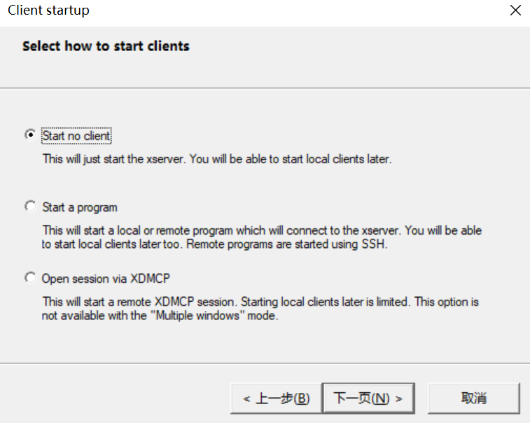

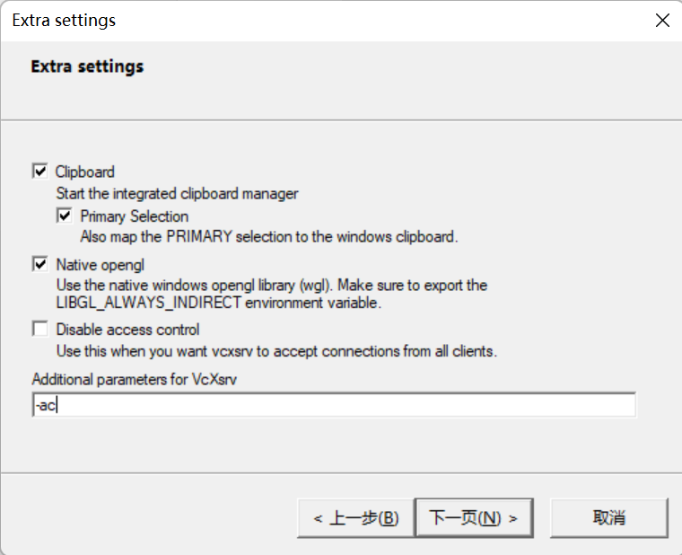

此时点击完成，就会弹出一个黑窗口，先不用管，打开ubuntu

安装xfce

```bash
sudo apt update
sudo apt install xfce4-terminal
sudo apt install xfce4
```

修改环境变量，在最后一行添加

```bash
cd ~
vi bashrc
export DISPLAY=IP:0
```

这里的IP，填写你自己的，在/etc/resolv.conf下查看

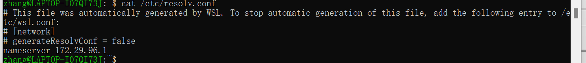

添加好后，不要忘记刷新环境变量

```bash
source .bashrc
```

在命令行启动

```bash
startxfce4
```

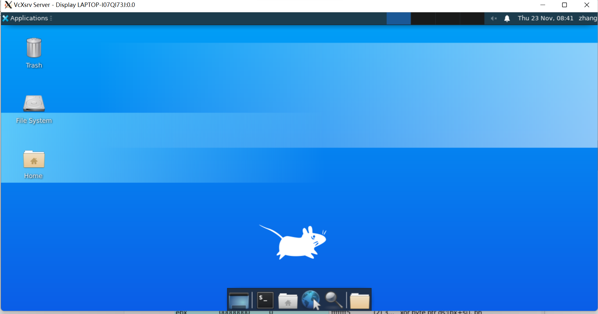

-------

### vscode配置

wsl在vsocde中不用配置，安装扩展


打开vscode，在远程连接的地方就可以看到ubuntu了

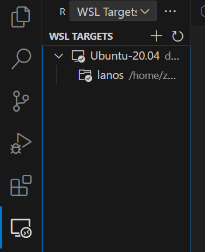

查看bin文件插件


汇编语言插件

​	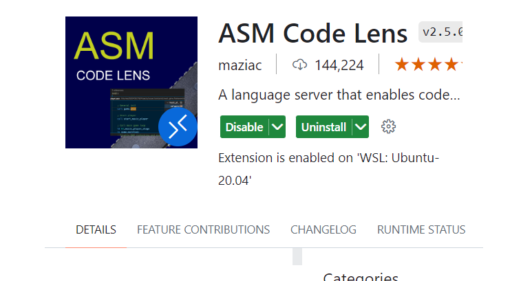

makefile插件

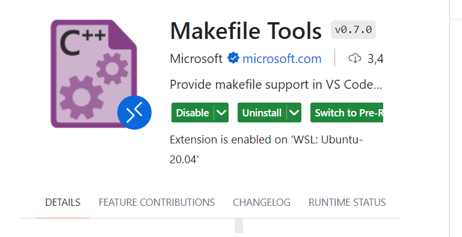


----

### 配置bochs

使用Ubuntu22系统配置bochs，这里如果直接`sudo apt install bochs-x`配置的，是不能正确运行的，错误如下：

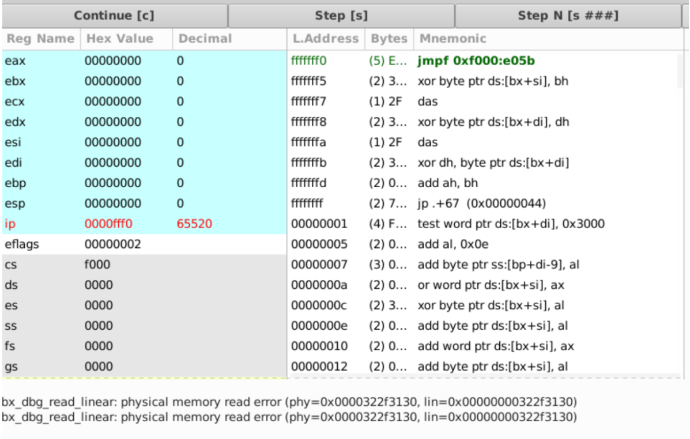

[解决方法：Stack Overflow](https://stackoverflow.com/questions/73067357/bochs-can-not-load-bootloader-using-a-floppy-image)

别的版本的Ubuntu应该是可以直接使用`apt install`安装的，22需要自己手动编译。

下载2.6.11版本的，如果使用2.7版本，大概率在make阶段会遇到SDL.h not found。但是使用2.6.11版本在编译的时候也会错误。**所以我转用20版本**

在Ubuntu20下完整配置

```bash
#安装
sudo apt update
sudo apt install bochs
sudo apt install bochs-x
```

进入工作空间

```bash
bochs
#step 1: 选4 save option to...
#step 2: bochs
#step 3: 选7 Quit now
```

此时在目录下面生成一个bocsrc的文件

创建一个磁盘

```bash
sudo bximage
#依次输入 1 hd flat 512 16 master.img
```

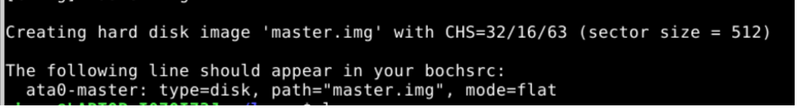

修改bochsrc文件

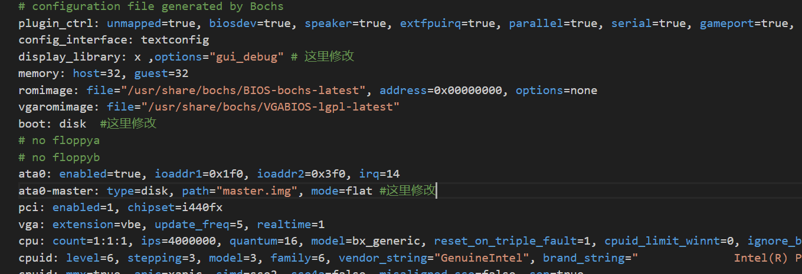

添加测试代码:

安装 nasm 汇编器
`sudo apt install nasm`

`vi hello.asm`

```
mov ax, 0xb800
mov ds, ax; 将代码段设置为 0xb800

mov byte [0], 'H'; 修改屏幕第一个字符为 T

; 下面阻塞停下来
halt:
    jmp halt

times 510 - ($ - $$) db 0 ; 用 0 填充满 510 个字节
db 0x55, 0xaa; 主引导扇区最后两个字节必须是 0x55aa
```

然后汇编成二进制代码：

```bash
nasm -f bin hello.asm -o hello.bin
```

然后将主引导扇区写入硬盘：

```bash
dd if=hello.bin of=master.img bs=512 count=1 conv=notrunc
```

启动 `bochs` 测试环境：

```bash
bochs -q
```

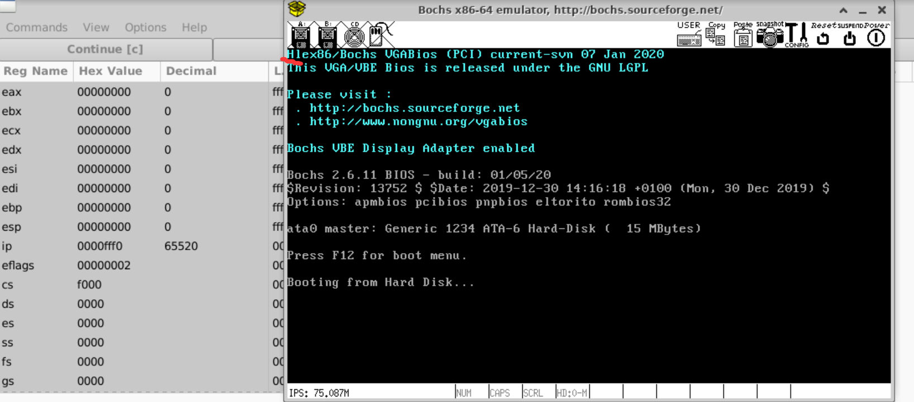

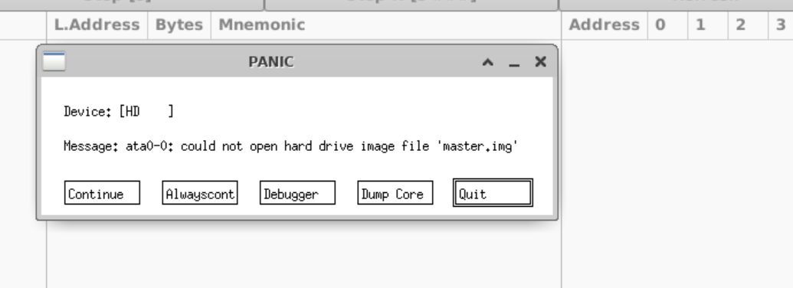

解决方法：
删除目录下的master.img.lock

## hello world

### 代码解释

```
;将显示模式设置为文本
mov ax,3
int 0x10 

mov ax, 0xb800
mov ds, ax; 将代码段设置为 0xb800

mov byte [0], 'H';
mov byte [2], 'e';
mov byte [4], 'l';
mov byte [6], 'l';
mov byte [8], 'o';
mov byte [10], ',';
mov byte [12], 'w';
mov byte [14], 'o';
mov byte [16], 'r';
mov byte [18], 'l';
mov byte [20], 'd';
mov byte [22], '!';

; 下面阻塞停下来
halt:
    jmp halt ;进入死循环

times 510 - ($ - $$) db 0 ; 用 0 填充满 510 个字节
db 0x55, 0xaa; 主引导扇区最后两个字节必须是 0x55aa
```

运行结果：

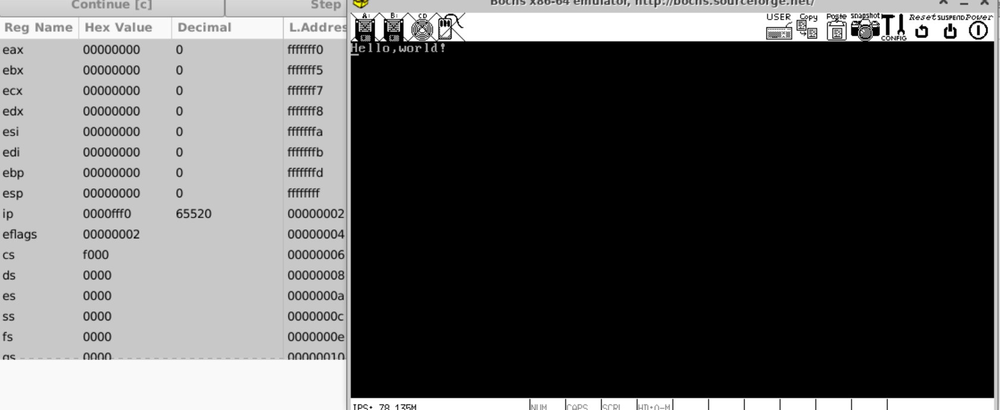

-----

```
mov ax,3
int 0x10
```

`int 0x10` 是一个中断调用，用于在 x86 架构的计算机上调用 BIOS 中断例程。这个特定的中断，`0x10`，是视频服务的中断向量。

在这个上下文中，`mov ax,3` 和 `int 0x10` 一起使用，用于设置显示模式。`ax` 寄存器的值 `3` 表示文本模式 80x25 单色/颜色。所以，这两行代码的作用是将显示模式设置为文本模式

----

```
mov ax, 0xb800
mov ds, ax; 将代码段设置为 0xb800
```

首先将代码段设置为0xb800，不过8086的实际物理地址是`段寄存器*16 + 地址`

也就是 0xb800 * 0x10 + 0 = 物理地址 0xb8000。

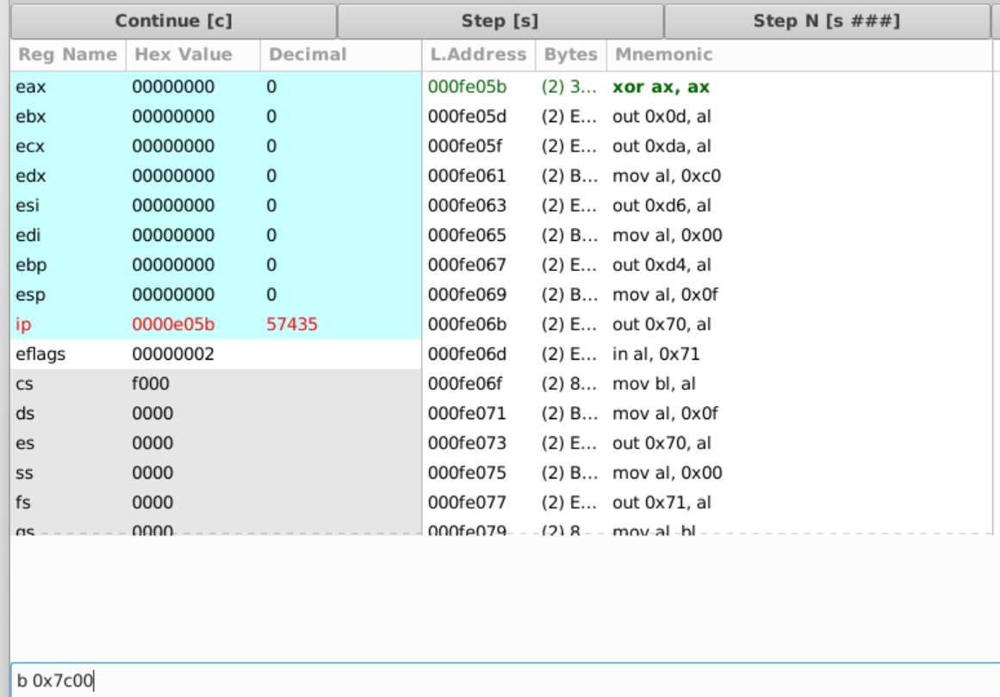

然后点c

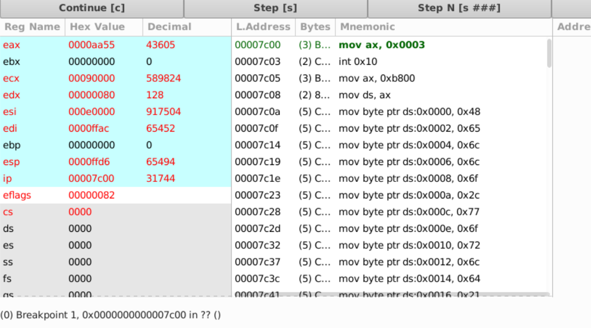

这里就可以查看寄存器的情况，点击view，再点击第一个，输入0x7c00，就可以查看当前的内存

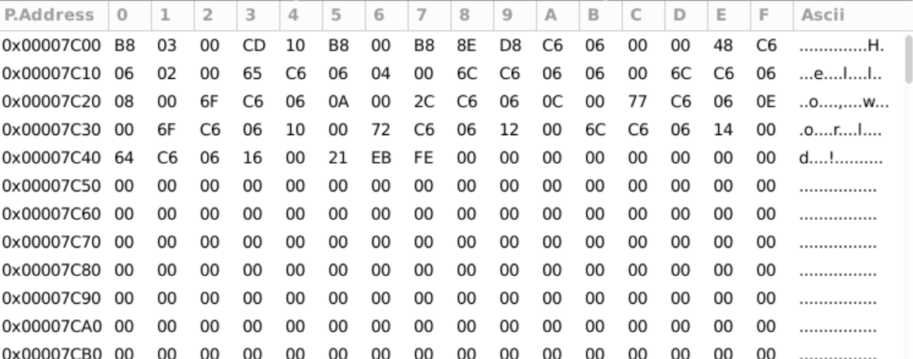

在这片区域中往后翻会找到一块内存中是0x55aa，因为主引导扇区的最后两个字节必须是0x55aa

----

```
mov byte [0], 'H';
mov byte [2], 'e';
mov byte [4], 'l';
mov byte [6], 'l';
mov byte [8], 'o';
mov byte [10], ',';
mov byte [12], 'w';
mov byte [14], 'o';
mov byte [16], 'r';
mov byte [18], 'l';
mov byte [20], 'd';
mov byte [22], '!';
```

在文本模式下，屏幕被视为一个二维字符数组，每个字符占用2个字节的空间。第一个字节用于表示字符本身，第二个字节用于表示字符的属性，如颜色和亮度等。

因此，当在屏幕上写入字符时，需要跳过属性字节，只修改字符字节。

例如，`mov byte [0], 'H'` 将字符 'H' 写入屏幕的第一个位置，`mov byte [2], 'e'` 将字符 'e' 写入屏幕的第二个位置，依此类推。每个字符的地址都是前一个地址加2，因为每个字符占用2个字节的空间。

-----

```
times 510 - ($ - $$) db 0 ; 用 0 填充满 510 个字节
db 0x55, 0xaa; 主引导扇区最后两个字节必须是 0x55aa
```

**是什么主引导扇区** 

主引导扇区（Master Boot Record，MBR）是硬盘的第一个扇区。它包含了一个小的启动程序（引导加载器）和分区表。当计算机启动时，BIOS会加载并执行主引导扇区的内容，从而开始启动操作系统。主引导扇区的大小是512个字节。其中，最后两个字节必须是0x55AA，这是一个标准的引导扇区签名，用于标识这个扇区是一个有效的主引导扇区。

`db 0x55, 0xaa`就是在设置这个签名，而`times 510 - ($ - $$) db 0`则是在填充剩余的空间，直到达到510个字节，以确保主引导扇区的总大小为512个字节。

`$`表示当前地址，`$$`表示当前段的开始地址。`times`是一个汇编指令，它的作用是重复执行后面的指令指定的次数。

`times 510 - ($ - $$) db 0`的含义就是：计算当前地址`$`与当前段的开始地址`$$`之间的差值，然后从510中减去这个差值，得到的结果就是需要填充的字节数。`db 0`表示填充的字节值为0。

所以当我们查看0x7c00的时候中间的代码都是0，**由于主引导扇区的大小是512，所以减去末尾的55aa，就剩下510个字节需要填充**

### 0x7c00

这个地址在上面反复出现，那么这个代表什么意思。

0x7c00就是MAR加载区域，加载到内存中的默认地址。当计算机启动并执行 POST（Power-On Self Test）后，BIOS 会从启动设备（如硬盘）的第一个扇区（即主引导扇区）读取 512 个字节的数据，并将这些数据加载到物理内存地址 `0x7C00` 处，然后跳转到这个地址开始执行。

也就是这个区域就是你的代码所在的地址

还有别的一些默认地址

| 起始地址 | 结束地址 | 大小     | 用途             |
| -------- | -------- | -------- | ---------------- |
| 0x000    | 0x3ff    | 1kb      | 中断向量表       |
| 0x400    | 0x4ff    | 256b     | BIOS数据区       |
| 0x500    | 0x7bff   | 29.75kb  | 可用区域         |
| 0x7c00   | 0x7dff   | 512b     | MBR 加载区域     |
| 0x7e00   | 0x9fbff  | 607.6kb  | 可用区域         |
| 0x9fc00  | 0x9ffff  | 1kb      | 扩展BIOS数据区   |
| 0xa0000  | 0xaffff  | 64kb     | 彩色显示适配器   |
| 0xb0000  | 0xb7fff  | 32kb     | 黑白显示适配器   |
| 0xb8000  | 0xbffff  | 32kb     | 文本显示适配器   |
| 0xc0000  | 0xc7fff  | 32kb     | 显示适配器 BIOS  |
| 0xc8000  | 0xeffff  | 160kb    | 映射内存         |
| 0xf0000  | 0xfffef  | 64kb-16b | 系统BIOS         |
| 0xffff0  | 0xfffff  | 16b      | 系统BIOS入口地址 |

## 基础

首先将上面所有的命令都编写到一个makefile文件中。

```makefile
# 编译boot.asm
boot.bin: boot.asm
	nasm boot.asm -o boot.bin

# 写入到虚拟硬盘
master.img: boot.bin
	dd if=boot.bin of=master.img bs=512 count=1 conv=notrunc

#删除生成的文件，和img.lock文件,不清楚这个文件为什么会出现，但是一出现这个,bochs就会报错,所以要删掉
.PHONY: clean # 伪目标,不生成文件,只是执行命令,不管有没有clean文件,都执行命令
clean:
	rm -f *.bin *.img.lock

# 运行bochs
.PHONY: bochs
bochs:
	bochs -q
```

然后再编写一个shell，添加内容

```shell
make clean
make boot.bin
make master.img
make bochs
```

这样不需要繁琐的运行了，直接运行这个shell脚本就可以了

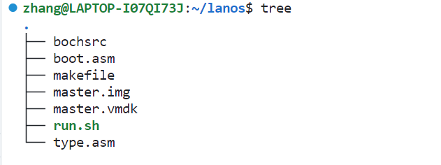

### 8086的寄存器

#### 通用寄存器

| 寄存器 | 描述               |
| ------ | ------------------ |
| AX     | 累加结果数据       |
| BX     | 数据段数据指针     |
| CX     | 字符串和循环计数器 |
| DX     | I/O 指针           |
| DI     | 目的数据指针       |
| SI     | 源数据指针         |
| SP     | 栈指针             |
| BP     | 栈数据指针         |

前四位可以分成高八位和第八位

| 寄存器 | 高八位 | 低八位 |
| ------ | ------ | ------ |
| AX     | AH     | AL     |
| BX     | BH     | BL     |
| CX     | CH     | CL     |
| DX     | DH     | DL     |

#### 段寄存器

| 段寄存器 | 描述         |
| -------- | ------------ |
| CS       | 代码段寄存器 |
| DS       | 数据段寄存器 |
| SS       | 栈段寄存器   |
| ES       | 额外的寄存器 |

#### IP和FLAG/PSW

##### 标志寄存器

| 位  | 标志 | 英文      | 描述         |
| --- | ---- | --------- | ------------ |
| 0   | CF   | Carry     | 进位标志     |
| 1   |      |           |              |
| 2   | PF   | Parity    | 奇偶标志     |
| 3   |      |           |              |
| 4   | AF   | Auxiliary | 辅助进位标志 |
| 5   |      |           |              |
| 6   | ZF   | Zero      | 零标志       |
| 7   | SF   | Sign      | 符号标志     |
| 8   | TF   | Trap      | 陷阱标志     |
| 9   | IF   | Interrupt | 中断允许标志 |
| 10  | DF   | Direction | 方向标志     |
| 11  | OF   | Overflow  | 溢出标志     |

示例：

```

```

加之前

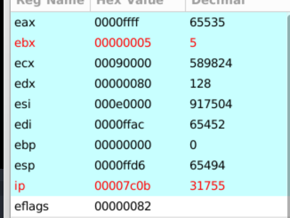

加之后

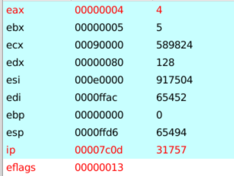


- 82: 1000_0010

- 13: 0001_0011 

这里的第零位从0变为了1

### 数据类型

- db   字节
- dw  字
- dd   双字

一个字是两个字节

新建一个type.asm，编译

```bash
touch type.asm
make tpye.bin
```

看一下两个数据类型，添加两行代码

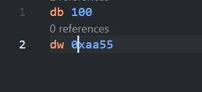

编译成功后查看二进制文件


我们本来存的是aa55，但是在内存中显示是55 aa，在8086的设计中使用的都是小端存储。这种设计延续至今，英特尔的CPU都是小端存储

使用数据类型，hello,world：

```
org 0x7c00 ;代码的起始位置

mov ax,3
int 0x10;清空屏幕

mov ax,0xb800
mov es,ax ;将es赋值0xb800

mov ax,0
mov ds,ax ;ds赋值0

mov si,message ;把message的地址赋给si寄存器
mov di,0;把0赋给di寄存器，di也是一个索引寄存器，它可以用来指定一个字符串的目的地址，这里就是把di寄存器的值设置为0，也就是显存的起始地址。
mov cx,(message_end-message);把(message_end-message)的值赋给cx寄存器，cx是一个计数寄存器

loop1:
    mov al,[ds:si];[ds:si]的值赋给al寄存器，al是一个8位的寄存器，它可以用来存储一个字符，[ds:si]是一个内存地址，它表示从ds寄存器的值开始，加上si寄存器的值的偏移量，得到的内存地址，这里就是把[ds:si]的值赋给al寄存器，也就是把消息的第一个字符赋给al寄存器。
    mov [es:di],al;这一行是用来把al寄存器的值赋给[es:di]，[es:di]也是一个内存地址，它表示从es寄存器的值开始，加上di寄存器的值的偏移量，得到的内存地址，这里就是把al寄存器的值赋给[es:di]，也就是把消息的第一个字符写入显存的第一个位置。

    inc si;si取出下一个字符
    add di,2;字符显示偶数，所以继续+2

    loop loop1

halt:
    jmp halt

message:
    db "hello,world!!",0;0，表示字符串的结束。
message_end:

times 510 -($-$$) db 0
db 0x55,0xaa
```

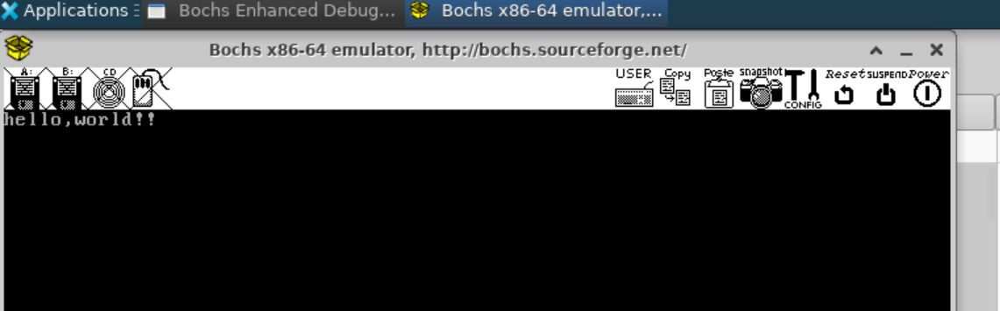

这里可以跳转到0x7c00单步调试查看运行的结果

### 寻址方式

#### 物理地址

物理地址 = 段地址*16 + 偏移地址，为什么不能直接使用物理地址？

8086是16位的cpu，也就是2的十六次方，可以访问64kb

但是8086最多可以访问1M的内存，也就是2的20次方

如何使用16位访问20位的地址，比一个形象的例子


此时从家到图书馆的物理地址是2326，也可以表示为2000+326

相对的如果你只有一个3个格子表示数字，但是表示2326需要四个格子，那么是不是可以使用200*10+326来表示物理地址。

在cpu中偏移地址就相当于326，段地址就是2000，那么表示物理地址就是那个公式，为什么*16？

这就可以看作是段地址 << 4，那么这样就是20位的地址再加上偏移地址就是实际的地址

[3.汇编指令：【寻址方式】立即数寻址、寄存器寻址、存储器寻址](https://blog.csdn.net/weixin_42214698/article/details/122428168)

### 算数运算指令

#### 加减法

```
org 0x7c00

mov ax,3
int 0x10

add word [number],5 ;加法运算
mov ax,5
mov bx,6
sub bx,ax; bx - ax 减法运算
halt:
    jmp halt

number:
    dw 0x3456

times 510 -($-$$) db 0
db 0x55,0xaa
```

#### 乘法

乘法由于一个寄存器可能存不下，因此如果一个寄存器存不下的就会存入dx之中

```
org 0x7c00
mov ax,3
int 0x10
mov ax,6
mov bx,5
mul bx;dx:ax = ax * bx，这里是mul后面接的乘数,而不是ax
halt:
    jmp halt

times 510 -($-$$) db 0
db 0x55,0xaa
```

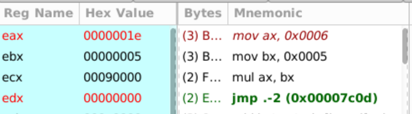

#### 除法

就是ax除以操作数 = 商存在ax，余数存在dx

```
org 0x7c00
mov ax,3
int 0x10
mov ax,6
mov bx,5
mul bx;dx:ax = ax * bx，这里是mul后面接的乘数,而不是ax
mov bx,4
div bx; ax: 7 bx: 2 | 30/4=7...2
halt:
    jmp halt

times 510 -($-$$) db 0
db 0x55,0xaa
```

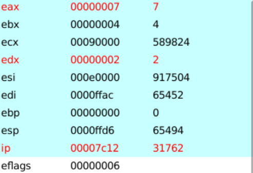

### 逻辑运算指令

- and 		与 ----> 还有一个test 这两个的关系和sub cmp一样，只做运算不更新数据更新标志位
- or            或
- not          非
- xor          异或
- SHL/SHR 移位
- ROL/ROR 循环移位
- RCL/RCR 带进位的循环移位


### 转移指令

8086 cs:ip 下一条指令的地址，物理地址 = cs << 4 + ip

```
org 0x7c00
mov ax,3
int 0x10

mov ax,0
mov cx,100

start:
    add ax,cx
    sub cx,1   
    jz end ; 如果cx == 0 就跳转到end
    jmp start
end:
halt:
    jmp halt

times 510 -($-$$) db 0
db 0x55,0xaa
```

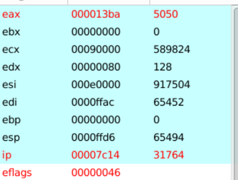

这是使用jmp实现的累加，但是如果是使用loop

```
start:
	add ax,cx
	loop start
```

这样就不需要自己动手cx-1，也不需要判断cx为0

### 堆栈和函数

栈顶指针：ss:sp 

```
org 0x7c00
mov ax,3
int 0x10
mov ax,0
mov ss,ax
mov sp,0x7c00
push byte 4
push dword 7
push word 5
pop ax
pop bx
pop cx
pop dx
halt:
    jmp halt
times 510 -($-$$) db 0
db 0x55,0xaa
```

进栈的顺序是4，0，7，5 ------> 这个0是dword的，双字。

因此得到的ax = 5 | bx = 7 | cx = 0 | dx = 4

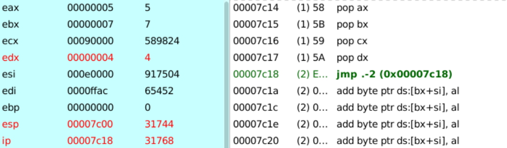

这个过程中栈指针的变化：

7c00 --> 7bfe -- >7bfa --> 7bf8 --> 7bfa -->7bfc -->7bfe --> 7bc00

可以看到在入栈的过程在，栈指针是减少的，在8086中栈的从高位到地位的，当push dword的时候，栈指针是-4的，word和byte是-2的。

**函数**

函数调用的时候就会创建一个栈帧，这是C语言里面学过的，在汇编中可以明显的看到这一个过程

```
org 0x7c00
mov ax,3
int 0x10

mov cx,25
loop1:
    call print
    loop loop1
halt:
    jmp halt
video:
    dw 0x0
print:
	push ax
	push es
	push bx
    
    mov ax,0xb800
    mov es,ax
    mov bx,[video]
    mov byte [es:bx],'|'
    add word [video],2
    
    pop bx
    pop es
    pop ax
    ret
times 510 -($-$$) db 0
db 0x55,0xaa
```

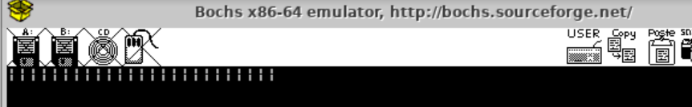

在调用print函数的时候，会先将loop loop1这条指令的地址入栈，然后再跳转到print处，因此call print这条命令的作用其实等价于

```
push ip ;汇编中是没有这个ip的，不过意思是这个意思
jmp print
```

同时在print中使用了三个寄存器，ax,bx,es，为了不影响其他函数的正常运行就需要先入栈寄存器的状态，然后在函数结束之前，再还原寄存器，这也就是函数的栈帧

### 输入输出

```
org 0x7c00
mov ax,3
int 0x10
mov ax,0xb800
mov es,ax
mov si,message
mov di,0
mov cx,message_end-message
print:
    mov bl,[si]
    mov [es:di],bl
    inc si
    add di,2
    loop print
halt:
    ;hlt ;关闭CPU，等待外中断的到来
    jmp halt
message:
    db "hello world",0
message_end:
times 510 -($-$$) db 0
db 0x55,0xaa
```

这段hello world的代码还有一些问题，就是窗口闪动的光标一直在第一个位置，并没有移动到后面

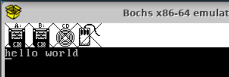

为了读取这个光标的位置，就需要输入输出指令来控制硬件（外围设备）

- 显示器
- 键盘
- 鼠标

两种方式：端口    映射内存

英特尔的端口是在0 - 65535

CRT(地址端口)：0x3D4  CRT(数据端口)：0x3D5

这里主要就涉及了in 和 out两个指令，不过学过8255A的话应该也比较好理解

```
org 0x7c00
CRT_ADDR_REG equ 0x3D4
CRT_DATA_REG equ 0x3D5
CRT_CURSOR_H equ 0x0E ;光标的高八位
CRT_CURSOR_L equ 0x0F ;光标的低八位

mov ax,3
int 0x10
mov ax,0
mov ds,ax
mov ss,ax
mov sp,0x7c00
mov ax,0xb800
mov es,ax
mov si, message
print:
    call get_cursor
    mov di,ax
    shl di,1

    mov bl,[si]
    cmp bl,0
    jz print_end

    mov [es:di],bl

    inc si
    inc ax
    call set_cursor
    jmp print
print_end:
halt:
    hlt
    jmp halt
get_cursor:
    push dx

    mov dx,CRT_ADDR_REG
    mov al,CRT_CURSOR_H
    out dx,al

    mov dx,CRT_DATA_REG
    in al,dx
    shl ax,8

    mov dx,CRT_ADDR_REG
    mov al,CRT_CURSOR_L
    out dx,al

    mov dx,CRT_DATA_REG
    in al,dx
    
    pop dx
    ret
set_cursor:
    push dx
    push bx
    mov bx,ax

    mov dx,CRT_ADDR_REG
    mov al,CRT_CURSOR_L
    out dx,al

    mov dx,CRT_DATA_REG
    mov al,bl
    out dx,al

    mov dx,CRT_ADDR_REG
    mov al,CRT_CURSOR_H
    out dx,al

    mov dx,CRT_DATA_REG
    mov al,bh
    out dx,al

    pop bx
    pop dx

    ret
message:
    db 'Hello, World!',0
times 510 -($-$$) db 0
db 0x55,0xaa
```


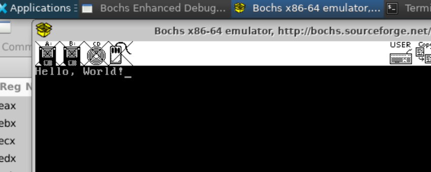

#### 字符样式

偶数位是控制的文本，奇数位就是文本的字符样式

- 高四位表示背景色 |K|R|G|B|
- 第四位表示前景色 |I |R|G|B|

K = 0 背景不闪烁  =1 闪烁

I   = 0 浅色             =1 深色

 

```
org 0x7c00
CRT_ADDR_REG equ 0x3D4
CRT_DATA_REG equ 0x3D5
CRT_CURSOR_H equ 0x0E ;光标的高八位
CRT_CURSOR_L equ 0x0F ;光标的低八位

mov ax,3
int 0x10
mov ax,0
mov ds,ax
mov ss,ax
mov sp,0x7c00
mov ax,0xb800
mov es,ax
mov si, message
print:
    call get_cursor
    mov di,ax
    shl di,1

    mov bl,[si]
    cmp bl,0
    jz print_end

    mov [es:di],bl
	mov byte [es:di+1], 0b0000_0011 ;设置样式
	
    inc si
    inc ax
    call set_cursor
    jmp print
print_end:
halt:
    hlt
    jmp halt
get_cursor:
    push dx

    mov dx,CRT_ADDR_REG
    mov al,CRT_CURSOR_H
    out dx,al

    mov dx,CRT_DATA_REG
    in al,dx
    shl ax,8

    mov dx,CRT_ADDR_REG
    mov al,CRT_CURSOR_L
    out dx,al

    mov dx,CRT_DATA_REG
    in al,dx
    
    pop dx
    ret
set_cursor:
    push dx
    push bx
    mov bx,ax

    mov dx,CRT_ADDR_REG
    mov al,CRT_CURSOR_L
    out dx,al

    mov dx,CRT_DATA_REG
    mov al,bl
    out dx,al

    mov dx,CRT_ADDR_REG
    mov al,CRT_CURSOR_H
    out dx,al

    mov dx,CRT_DATA_REG
    mov al,bh
    out dx,al

    pop bx
    pop dx

    ret
message:
    db 'Hello, World!',0
times 510 -($-$$) db 0
db 0x55,0xaa
```

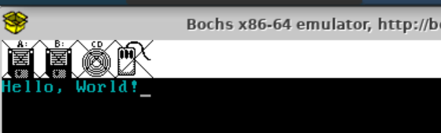

### 中断

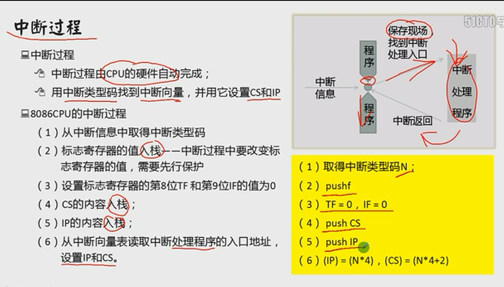

#### 内中断和异常

远调用：如果函数的调用在寄存器之外就需要远调用

普通调用就只需要保存下一条指令的IP就可以了，但是远调用不仅仅需要需要保存，还需要保存寄存器。

call func --> push IP    jmp func

call far func --> push cs   push ip   jmp func

```
org 0x7c00
mov ax,3
int 0x10

mov cx,25
loop1:
    call 0:print ;callf 
    loop loop1
halt:
    jmp halt
video:
    dw 0x0
print:
    push ax
    push es
    push bx
    mov ax,0xb800
    mov es,ax
    mov bx,[video]
    mov byte [es:bx],'|'
    add word [video],2
    pop bx
    pop es
    pop ax
    retf ;远调用是需要使用retf
times 510 -($-$$) db 0
db 0x55,0xaa
```

这种是直接跳转还有一种间接跳转的方式

```
org 0x7c00
mov ax,3
int 0x10

mov ax,0
mov dx,ax
mov cx,25
loop1:
    ;call 0:print ;callf 
    call far [func]
    loop loop1
halt:
    jmp halt
video:
    dw 0x0
print:
    push ax
    push es
    push bx
    mov ax,0xb800
    mov es,ax
    mov bx,[video]
    mov byte [es:bx],'|'
    add word [video],2
    pop bx
    pop es
    pop ax
    retf ;远调用是需要使用retf
func:
	dw print,0
times 510 -($-$$) db 0
db 0x55,0xaa
```

内中断表的起始位置是0x000，结束位置是0x3ff，也就是0x400

一个中断向量占4个字节，一个是段地址，一个偏移地址，0x400 / 4 = 0x100 也就是一共有256个中断向量

中断号就是0 - 255号

0 号是除法异常，内存就是从0到3

0x80是linux的系统调用，不过8086中是没有Linux的，从386开始才有，不过这里就用与代表软中断

0x80的向量地址就是0x80 * 4  + 3

在使用内中断之前要是注册中断函数

```
org 0x7c00
mov ax,3
int 0x10

;mov word [0x80 * 4], print
;mov word [0x80 * 4 + 2], 0

mov word [0x0 * 4], div_error ;根据中断号找到入口程序
mov word [0x0 * 4 + 2], 0
mov dx,0
mov ax,0
mov bx,0
div bx
halt:
    jmp halt
video:
    dw 0x0
print:
    push ax
    push es
    push bx
    mov ax,0xb800
    mov es,ax
    mov bx,[video]
    mov byte [es:bx],'|'
    add word [video],2
    pop bx
    pop es
    pop ax
    ;ret
    ;retf
    iret 
div_error:
    push ax
    push es
    push bx
    mov ax,0xb800
    mov es,ax
    mov ax,0
    mov ds,ax 
    mov si,message
    mov di,0;
    mov cx,(message_end-message);
    loop1:
        mov al,[ds:si];
        mov [es:di],al;
        inc si;
        add di,2;
        loop loop1
    pop bx
    pop es
    pop ax
    ;ret
    ;retf
    iret 
message:
    db "div is error",0
message_end:
times 510 -($-$$) db 0
db 0x55,0xaa
```

这段代码在运行的时候div的除数的0，这就触发中断函数，从而调用div_error，在屏幕中打印div is error

并且中断调用不仅仅会保存下一个指令的IP，CS，还有保存标志寄存器

这里段代码使用的函数返回是iret，到这里已经使用过3中ret

ret：就只返回IP                                             普通函数调用

retf：返回IP还有CS									    远调用

iret：返回IP，CS以及标志寄存位				 中断调用

#### 外中断和时钟

8259 - 可编程中断控制器 / PIC Programmable Interrupt Controller
- 主芯片 - 8 1
-  从芯片 - 8
- 级联方式

**中断向量表：**

向量  | 功能
-- | ------
0   |除法溢出
1   |单步 (用于调试)
2	|非屏蔽中断 NMI
3	|断点 (用于调试)
4	|溢出中断
5	|打印屏幕
6-7	|保留
8	|时钟
9	|键盘
A	|保留
B	|串行通信COM2
C	|串行通信COM1
D	|保留
E	|软盘控制器
F	|并行打印机

端口 | 说明 | 标记
----|  ---- | ---
0x20	|主 PIC 命令端口	|PIC_M_CMD
0x21	|主 PIC 数据端口	|PIC_M_DATA
0xA0	|从 PIC 命令端口	|PIC_S_CMD
0xA1	|从 PIC 数据端口	|PIC_S_DATA
- ICW1 ~ ICW4 用于初始化 8259 initialization Command Words
- OCW1 ~ OCW3 用于操作 8259 Operation Commands Words
-----------
这里以处理时钟的中断为例
- 向 OCW1 写入屏蔽字，打开时钟中断
- sti 设置 CPU 允许外中断
- 向 OCW2 写入 0x20, 表示中断处理完毕
- IF 是 CPU 的外中断开关
- MASK 中断屏蔽开关 是 8259 总开关
```
org 0x7c00
PIC_M_CMD equ 0x20
PIC_M_DATA equ 0x21
mov ax,3
int 0x10
mov ax,0
mov ds,ax
mov ss,ax
mov sp,0x7c00
;注册中断函数
mov word [8*4],clock
mov word [8*4+2],0
mov al,0b1111_1110
out PIC_M_DATA,al
sti; IF = 1  set interrupt CPU允许中断
;cli         clear interrupt
;clc         clear carry
loopa:
    mov bx,3
    mov al,'A'
    call blink
    jmp loopa
clock:
    push bx
    push ax
    mov bx,4
    mov al,'C'
    call blink
    mov al,0x20
    out PIC_M_CMD,al
    pop ax
    pop bx
    iret
blink:
    push es 
    push bx
    mov dx,0xb800
    mov es,dx

    shl bx,1
    mov dl,[es:bx]
    cmp dl,' '
    jnz .set_space
    .set_char:
        mov [es:bx],al
        jmp .done
    .set_space:
        mov byte [es:bx], ' '
    .done:
        shr bx,1
    pop bx
    pop es
    ret
times 510 -($-$$) db 0
db 0x55,0xaa
```
这段代码a和c会在3，4的位置闪烁，在调用clock函数的时候会的会将三个值压入栈中
```
push ip
push cs
push flags
```
为什么要保存flags，在调用之前flags是0x206，调用之后是0x006
0x206: 0b0010_0000_0110
0x006: 0b0000_0000_0110
第9位由1置为了0
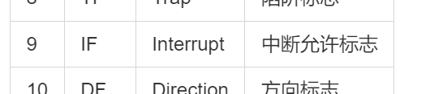
由于是已经调用了中断，因此需要将这个标志位置为0，防止CPU误以为可以中断，导致中断嵌套

---
## 代码整理
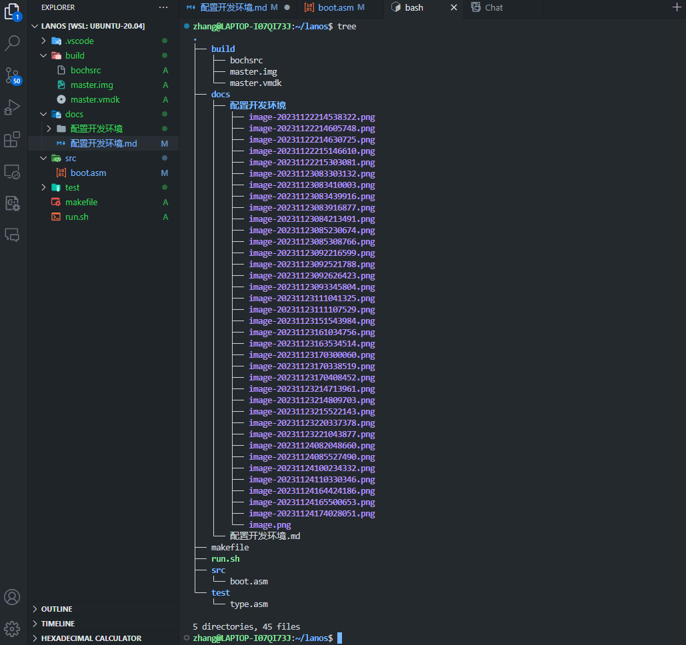
修改makefile文件
```
# 编译boot.asm
build/%.bin: src/%.asm
	nasm $< -o $@

# 写入到虚拟硬盘
build/master.img: build/boot.bin
	dd if=build/boot.bin of=build/master.img bs=512 count=1 conv=notrunc

#删除生成的文件，和img.lock文件,不清楚这个文件为什么会出现，但是一出现这个,bochs就会报错,所以要删掉
.PHONY: clean # 伪目标,不生成文件,只是执行命令,不管有没有clean文件,都执行命令
clean:
	rm -rf build/bx_enh_dbg.ini
	rm -f build/*.bin build/*.img.lock

# 运行bochs
.PHONY: bochs
bochs: build/master.img
	cd build && bochs -q
```
修改run.sh文件
```
#!/bin/bash
set -e

make build/boot.bin || { echo "make boot.bin错误!"; exit 1; }
make build/master.img || { echo "make master.img错误!"; exit 1; }
make bochs || { echo "make bochs错误"; exit 1; }
```
---
## PC启动

### 硬盘读写

**pc的状态**

主引导扇区只有512个字节，而且并不是所有的都可以用，这里512个字节还包括了硬盘的分区
如果程序大于512就无法使用，就必须从内存中读取在继续执行

[bochs硬盘存储结构](https://nightmare-man.github.io/2020/06/10/bochs%E4%BD%BF%E7%94%A8%E5%8F%8A%E7%A1%AC%E7%9B%98%E5%82%A8%E5%AD%98%E7%BB%93%E6%9E%84%E8%AF%A6%E8%A7%A3.html)

| Primary 通道            | Secondary 通道 | in 操作      | out 操作     |
| ----------------------- | -------------- | ------------ | ------------ |
| Command Block Registers |                |              |              |
| 0x1F0                   | 0x170          | Data         | Data         |
| 0x1F1                   | 0x171          | Error        | Features     |
| 0x1F2                   | 0x172          | Sector count | Sector count |
| 0x1F3                   | 0x173          | LBA low      | LBA low      |
| 0x1F4                   | 0x174          | LBA mid      | LBA mid      |
| 0x1F5                   | 0x175          | LBA high     | LBA high     |
| 0x1F6                   | 0x176          | Device       | Device       |
| 0x1F7                   | 0x177          | Status       | Command      |

------

- 0x1F0 / 16bit 读写数据

- 0x1F1

- 0x1F2 / 扇区数量

- 0x1F3 - 0x1F5 / 起始扇区的前 24 位 0 ~ 23 位

- 0x1F6

  - 0 - 3 / LBA 24 ~ 27 位
  - 4：0 主盘，1 从盘
  - 6：0 CHS 模式 ， 1 LBA
  - 5 7 : 固定为 1

- 0x1F7： out

  - 0xEC：识别硬盘
  - 0x20：读硬盘
  - 0x30：写硬盘

  in

  - 0 ERR
  - 3 DRQ 数据准备完毕
  - 7 BUSY 硬盘繁忙

```
org 0x7c00
mov ax,3
int 0x10

mov ax,0;
mov ds,ax  
mov ss,ax
mov sp,0x7c00
mov dx,0x1f2
mov al,1
out dx,al
mov al,0
inc dx; 0x1f3
out dx,al
inc dx; 0x1f4
out dx,al
inc dx; 0x1f5
out dx,al
inc dx;
mov al,0b1110_0000
out dx,al
inc dx;0x1f7
mov al,0x20 ;读硬盘
out dx,al
.check_read_state:
    nop
    nop
    nop ;加延迟 ATA的要求

    in al,dx
    and al,0b1000_1000
    cmp al,0b0000_1000
    jnz .check_read_state
mov ax,0x100
mov es,ax
mov di,0
mov dx,0x1f0

read_loop:
    nop
    nop
    nop
    in ax,dx
    mov [es:di],ax
    add di,2
    cmp di,512
    jnz read_loop

mov dx,0x1f2
mov al,1
out dx,al
mov al,2
inc dx; 0x1f3
out dx,al
mov al,0 
inc dx; 0x1f4
out dx,al
inc dx; 0x1f5
out dx,al
inc dx;
mov al,0b1110_0000
out dx,al
inc dx;0x1f7
mov al,0x30 ;写硬盘
out dx,al

mov ax,0x100
mov es,ax
mov di,0
mov dx,0x1f0

write_loop:
    nop
    nop
    nop
    mov ax,[es:di]
    out dx,ax
    add di,2
    cmp di,512
    jnz write_loop
mov dx,0x1f7 
.check_write_state:
    nop
    nop
    nop ;加延迟 ATA的要求

    in al,dx
    and al,0b1000_0000
    cmp al,0b1000_0000
    jz .check_write_state
jmp $
times 510 -($-$$) db 0
db 0x55,0xaa
```

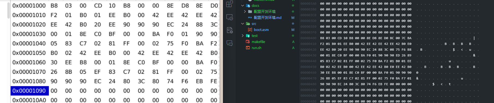

