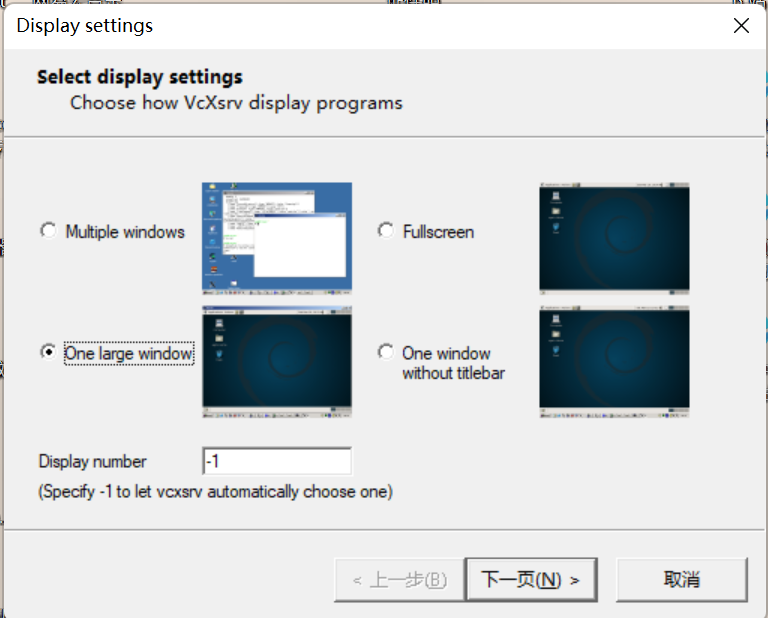
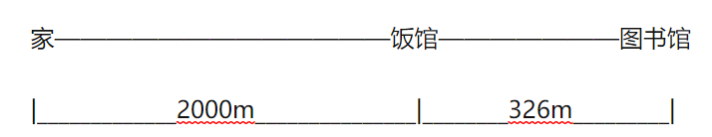
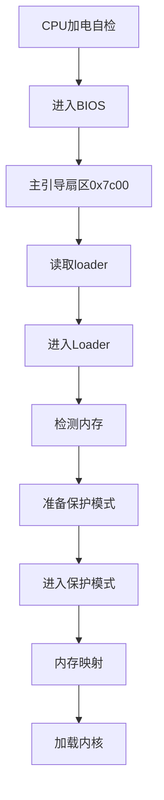
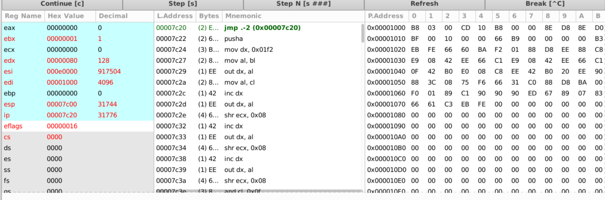
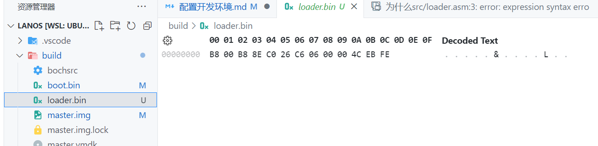
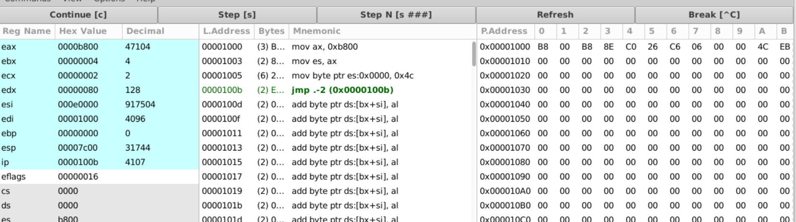
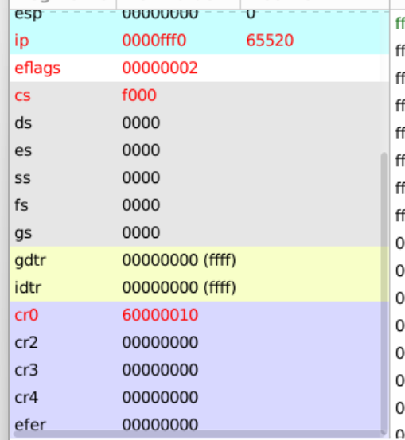
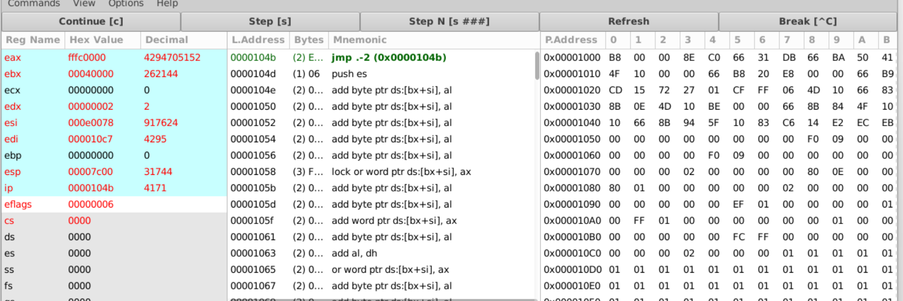

[TOC]
## 前言

根据b站up主[踌躇月光](https://space.bilibili.com/491131440)学习

[视频链接](https://www.bilibili.com/video/BV1b44y1k7mT?p=1&vd_source=f342719b375d872cded85ce2655fee5d)

虽然是x86汇编语言，但是仍然需要一些基本的汇编基础，建议(必须)先过一遍王爽老师的汇编语言，再进行这部分的学习，这是部分是自己写os的前置需求

## 配置开发环境

### wsl图形界面

由于调试需要使用bochs，这是一个图形界面的工具，使用命令行是会报错的，因此需要使用Gui，如果是虚拟机，或者是双系统可以直接跳过。

首先安装wsl，以及ubuntu20，直接根据官方文档安装即可。[官译版正经安装WSL，非常适合小白（亲测有效） - 知乎 (zhihu.com)](https://zhuanlan.zhihu.com/p/633320480?utm_id=0)

两种方式，一种是安装ubuntu-desktop桌面，另一种是安装xfce4桌面。这里采用第二种。

首先Windows安装xfce4软件

[下载地址](https://sourceforge.net/projects/xming)

启动！软件




此时点击完成，就会弹出一个黑窗口，先不用管，打开ubuntu

安装xfce

```bash
sudo apt update
sudo apt install xfce4-terminal
sudo apt install xfce4
```

修改环境变量，在最后一行添加

```bash
cd ~
vi bashrc
export DISPLAY=IP:0
```

这里的IP，填写你自己的，在/etc/resolv.conf下查看


添加好后，不要忘记刷新环境变量

```bash
source .bashrc
```

在命令行启动

```bash
startxfce4
```


-------

### vscode配置

wsl在vsocde中不用配置，安装扩展


打开vscode，在远程连接的地方就可以看到ubuntu了


查看bin文件插件


汇编语言插件

​	

makefile插件


----

### 配置bochs

使用Ubuntu22系统配置bochs，这里如果直接`sudo apt install bochs-x`配置的，是不能正确运行的，错误如下：


[解决方法：Stack Overflow](https://stackoverflow.com/questions/73067357/bochs-can-not-load-bootloader-using-a-floppy-image)

别的版本的Ubuntu应该是可以直接使用`apt install`安装的，22需要自己手动编译。

下载2.6.11版本的，如果使用2.7版本，大概率在make阶段会遇到SDL.h not found。但是使用2.6.11版本在编译的时候也会错误。**所以我转用20版本**

在Ubuntu20下完整配置

```bash
#安装
sudo apt update
sudo apt install bochs
sudo apt install bochs-x
```

进入工作空间

```bash
bochs
#step 1: 选4 save option to...
#step 2: bochs
#step 3: 选7 Quit now
```

此时在目录下面生成一个bocsrc的文件

创建一个磁盘

```bash
sudo bximage
#依次输入 1 hd flat 512 16 master.img
```


修改bochsrc文件


添加测试代码:

安装 nasm 汇编器
`sudo apt install nasm`

`vi hello.asm`

```
mov ax, 0xb800
mov ds, ax; 将代码段设置为 0xb800

mov byte [0], 'H'; 修改屏幕第一个字符为 T

; 下面阻塞停下来
halt:
    jmp halt

times 510 - ($ - $$) db 0 ; 用 0 填充满 510 个字节
db 0x55, 0xaa; 主引导扇区最后两个字节必须是 0x55aa
```

然后汇编成二进制代码：

```bash
nasm -f bin hello.asm -o hello.bin
```

然后将主引导扇区写入硬盘：

```bash
dd if=hello.bin of=master.img bs=512 count=1 conv=notrunc
```

启动 `bochs` 测试环境：

```bash
bochs -q
```


解决方法：
删除目录下的master.img.lock

## hello world

### 代码解释

```s
;将显示模式设置为文本
mov ax,3
int 0x10 

mov ax, 0xb800
mov ds, ax; 将代码段设置为 0xb800

mov byte [0], 'H';
mov byte [2], 'e';
mov byte [4], 'l';
mov byte [6], 'l';
mov byte [8], 'o';
mov byte [10], ',';
mov byte [12], 'w';
mov byte [14], 'o';
mov byte [16], 'r';
mov byte [18], 'l';
mov byte [20], 'd';
mov byte [22], '!';

; 下面阻塞停下来
halt:
    jmp halt ;进入死循环

times 510 - ($ - $$) db 0 ; 用 0 填充满 510 个字节
db 0x55, 0xaa; 主引导扇区最后两个字节必须是 0x55aa
```

运行结果：


-----

```s
mov ax,3
int 0x10
```

`int 0x10` 是一个中断调用，用于在 x86 架构的计算机上调用 BIOS 中断例程。这个特定的中断，`0x10`，是视频服务的中断向量。

在这个上下文中，`mov ax,3` 和 `int 0x10` 一起使用，用于设置显示模式。`ax` 寄存器的值 `3` 表示文本模式 80x25 单色/颜色。所以，这两行代码的作用是将显示模式设置为文本模式

----

```s
mov ax, 0xb800
mov ds, ax; 将代码段设置为 0xb800
```

首先将代码段设置为0xb800，不过8086的实际物理地址是`段寄存器*16 + 地址`

也就是 0xb800 * 0x10 + 0 = 物理地址 0xb8000。


然后点c


这里就可以查看寄存器的情况，点击view，再点击第一个，输入0x7c00，就可以查看当前的内存


在这片区域中往后翻会找到一块内存中是0x55aa，因为主引导扇区的最后两个字节必须是0x55aa

----

```s
mov byte [0], 'H';
mov byte [2], 'e';
mov byte [4], 'l';
mov byte [6], 'l';
mov byte [8], 'o';
mov byte [10], ',';
mov byte [12], 'w';
mov byte [14], 'o';
mov byte [16], 'r';
mov byte [18], 'l';
mov byte [20], 'd';
mov byte [22], '!';
```

在文本模式下，屏幕被视为一个二维字符数组，每个字符占用2个字节的空间。第一个字节用于表示字符本身，第二个字节用于表示字符的属性，如颜色和亮度等。

因此，当在屏幕上写入字符时，需要跳过属性字节，只修改字符字节。

例如，`mov byte [0], 'H'` 将字符 'H' 写入屏幕的第一个位置，`mov byte [2], 'e'` 将字符 'e' 写入屏幕的第二个位置，依此类推。每个字符的地址都是前一个地址加2，因为每个字符占用2个字节的空间。

-----

```s
times 510 - ($ - $$) db 0 ; 用 0 填充满 510 个字节
db 0x55, 0xaa; 主引导扇区最后两个字节必须是 0x55aa
```

**是什么主引导扇区** 

主引导扇区（Master Boot Record，MBR）是硬盘的第一个扇区。它包含了一个小的启动程序（引导加载器）和分区表。当计算机启动时，BIOS会加载并执行主引导扇区的内容，从而开始启动操作系统。主引导扇区的大小是512个字节。其中，最后两个字节必须是0x55AA，这是一个标准的引导扇区签名，用于标识这个扇区是一个有效的主引导扇区。

`db 0x55, 0xaa`就是在设置这个签名，而`times 510 - ($ - $$) db 0`则是在填充剩余的空间，直到达到510个字节，以确保主引导扇区的总大小为512个字节。

`$`表示当前地址，`$$`表示当前段的开始地址。`times`是一个汇编指令，它的作用是重复执行后面的指令指定的次数。

`times 510 - ($ - $$) db 0`的含义就是：计算当前地址`$`与当前段的开始地址`$$`之间的差值，然后从510中减去这个差值，得到的结果就是需要填充的字节数。`db 0`表示填充的字节值为0。

所以当我们查看0x7c00的时候中间的代码都是0，**由于主引导扇区的大小是512，所以减去末尾的55aa，就剩下510个字节需要填充**

### 0x7c00

这个地址在上面反复出现，那么这个代表什么意思。

0x7c00就是MAR加载区域，加载到内存中的默认地址。当计算机启动并执行 POST（Power-On Self Test）后，BIOS 会从启动设备（如硬盘）的第一个扇区（即主引导扇区）读取 512 个字节的数据，并将这些数据加载到物理内存地址 `0x7C00` 处，然后跳转到这个地址开始执行。

也就是这个区域就是你的代码所在的地址

还有别的一些默认地址

| 起始地址 | 结束地址 | 大小     | 用途             |
| -------- | -------- | -------- | ---------------- |
| 0x000    | 0x3ff    | 1kb      | 中断向量表       |
| 0x400    | 0x4ff    | 256b     | BIOS数据区       |
| 0x500    | 0x7bff   | 29.75kb  | 可用区域         |
| 0x7c00   | 0x7dff   | 512b     | MBR 加载区域     |
| 0x7e00   | 0x9fbff  | 607.6kb  | 可用区域         |
| 0x9fc00  | 0x9ffff  | 1kb      | 扩展BIOS数据区   |
| 0xa0000  | 0xaffff  | 64kb     | 彩色显示适配器   |
| 0xb0000  | 0xb7fff  | 32kb     | 黑白显示适配器   |
| 0xb8000  | 0xbffff  | 32kb     | 文本显示适配器   |
| 0xc0000  | 0xc7fff  | 32kb     | 显示适配器 BIOS  |
| 0xc8000  | 0xeffff  | 160kb    | 映射内存         |
| 0xf0000  | 0xfffef  | 64kb-16b | 系统BIOS         |
| 0xffff0  | 0xfffff  | 16b      | 系统BIOS入口地址 |

## 基础

首先将上面所有的命令都编写到一个makefile文件中。

```makefile
# 编译boot.asm
boot.bin: boot.asm
	nasm boot.asm -o boot.bin

# 写入到虚拟硬盘
master.img: boot.bin
	dd if=boot.bin of=master.img bs=512 count=1 conv=notrunc

#删除生成的文件，和img.lock文件,不清楚这个文件为什么会出现，但是一出现这个,bochs就会报错,所以要删掉
.PHONY: clean # 伪目标,不生成文件,只是执行命令,不管有没有clean文件,都执行命令
clean:
	rm -f *.bin *.img.lock

# 运行bochs
.PHONY: bochs
bochs:
	bochs -q
```

然后再编写一个shell，添加内容

```shell
make clean
make boot.bin
make master.img
make bochs
```

这样不需要繁琐的运行了，直接运行这个shell脚本就可以了


### 8086的寄存器

#### 通用寄存器

| 寄存器 | 描述               |
| ------ | ------------------ |
| AX     | 累加结果数据       |
| BX     | 数据段数据指针     |
| CX     | 字符串和循环计数器 |
| DX     | I/O 指针           |
| DI     | 目的数据指针       |
| SI     | 源数据指针         |
| SP     | 栈指针             |
| BP     | 栈数据指针         |

前四位可以分成高八位和第八位

| 寄存器 | 高八位 | 低八位 |
| ------ | ------ | ------ |
| AX     | AH     | AL     |
| BX     | BH     | BL     |
| CX     | CH     | CL     |
| DX     | DH     | DL     |

#### 段寄存器

| 段寄存器 | 描述         |
| -------- | ------------ |
| CS       | 代码段寄存器 |
| DS       | 数据段寄存器 |
| SS       | 栈段寄存器   |
| ES       | 额外的寄存器 |

#### IP和FLAG/PSW

##### 标志寄存器

| 位  | 标志 | 英文      | 描述         |
| --- | ---- | --------- | ------------ |
| 0   | CF   | Carry     | 进位标志     |
| 1   |      |           |              |
| 2   | PF   | Parity    | 奇偶标志     |
| 3   |      |           |              |
| 4   | AF   | Auxiliary | 辅助进位标志 |
| 5   |      |           |              |
| 6   | ZF   | Zero      | 零标志       |
| 7   | SF   | Sign      | 符号标志     |
| 8   | TF   | Trap      | 陷阱标志     |
| 9   | IF   | Interrupt | 中断允许标志 |
| 10  | DF   | Direction | 方向标志     |
| 11  | OF   | Overflow  | 溢出标志     |

示例：

```

```

加之前


加之后


- 82: 1000_0010

- 13: 0001_0011 

这里的第零位从0变为了1

### 数据类型

- db   字节
- dw  字
- dd   双字

一个字是两个字节

新建一个type.asm，编译

```bash
touch type.asm
make tpye.bin
```

看一下两个数据类型，添加两行代码


编译成功后查看二进制文件


我们本来存的是aa55，但是在内存中显示是55 aa，在8086的设计中使用的都是小端存储。这种设计延续至今，英特尔的CPU都是小端存储

使用数据类型，hello,world：

```s
org 0x7c00 ;代码的起始位置

mov ax,3
int 0x10;清空屏幕

mov ax,0xb800
mov es,ax ;将es赋值0xb800

mov ax,0
mov ds,ax ;ds赋值0

mov si,message ;把message的地址赋给si寄存器
mov di,0;把0赋给di寄存器，di也是一个索引寄存器，它可以用来指定一个字符串的目的地址，这里就是把di寄存器的值设置为0，也就是显存的起始地址。
mov cx,(message_end-message);把(message_end-message)的值赋给cx寄存器，cx是一个计数寄存器

loop1:
    mov al,[ds:si] ;[ds:si]的值赋给al寄存器，al是一个8位的寄存器，它可以用来存储一个字符，[ds:si]是一个内存地址，它表示从ds寄存器的值开始，加上si寄存器的值的偏移量，得到的内存地址，这里就是把[ds:si]的值赋给al寄存器，也就是把消息的第一个字符赋给al寄存器。
    mov [es:di],al;这一行是用来把al寄存器的值赋给[es:di]，[es:di]也是一个内存地址，它表示从es寄存器的值开始，加上di寄存器的值的偏移量，得到的内存地址，这里就是把al寄存器的值赋给[es:di]，也就是把消息的第一个字符写入显存的第一个位置。

    inc si;si取出下一个字符
    add di,2;字符显示偶数，所以继续+2

    loop loop1

halt:
    jmp halt

message:
    db "hello,world!!",0;0，表示字符串的结束。
message_end:

times 510 -($-$$) db 0
db 0x55,0xaa
```


这里可以跳转到0x7c00单步调试查看运行的结果

### 寻址方式

#### 物理地址

物理地址 = 段地址*16 + 偏移地址，为什么不能直接使用物理地址？

8086是16位的cpu，也就是2的十六次方，可以访问64kb

但是8086最多可以访问1M的内存，也就是2的20次方

如何使用16位访问20位的地址，比一个形象的例子



此时从家到图书馆的物理地址是2326，也可以表示为2000+326

相对的如果你只有一个3个格子表示数字，但是表示2326需要四个格子，那么是不是可以使用200*10+326来表示物理地址。

在cpu中偏移地址就相当于326，段地址就是2000，那么表示物理地址就是那个公式，为什么*16？

这就可以看作是段地址 << 4，那么这样就是20位的地址再加上偏移地址就是实际的地址

[3.汇编指令：【寻址方式】立即数寻址、寄存器寻址、存储器寻址](https://blog.csdn.net/weixin_42214698/article/details/122428168)

### 算数运算指令

#### 加减法

```s
org 0x7c00

mov ax,3
int 0x10

add word [number],5 ;加法运算
mov ax,5
mov bx,6
sub bx,ax; bx - ax 减法运算
halt:
    jmp halt

number:
    dw 0x3456

times 510 -($-$$) db 0
db 0x55,0xaa
```

#### 乘法

乘法由于一个寄存器可能存不下，因此如果一个寄存器存不下的就会存入dx之中

```s
org 0x7c00
mov ax,3
int 0x10
mov ax,6
mov bx,5
mul bx;dx:ax = ax * bx，这里是mul后面接的乘数,而不是ax
halt:
    jmp halt

times 510 -($-$$) db 0
db 0x55,0xaa
```


#### 除法

就是ax除以操作数 = 商存在ax，余数存在dx

```s
org 0x7c00
mov ax,3
int 0x10
mov ax,6
mov bx,5
mul bx;dx:ax = ax * bx，这里是mul后面接的乘数,而不是ax
mov bx,4
div bx; ax: 7 bx: 2 | 30/4=7...2
halt:
    jmp halt

times 510 -($-$$) db 0
db 0x55,0xaa
```


### 逻辑运算指令

- and 		与 ----> 还有一个test 这两个的关系和sub cmp一样，只做运算不更新数据更新标志位
- or            或
- not          非
- xor          异或
- SHL/SHR 移位
- ROL/ROR 循环移位
- RCL/RCR 带进位的循环移位


### 转移指令

8086 cs:ip 下一条指令的地址，物理地址 = cs << 4 + ip

```s
org 0x7c00
mov ax,3
int 0x10

mov ax,0
mov cx,100

start:
    add ax,cx
    sub cx,1   
    jz end ; 如果cx == 0 就跳转到end
    jmp start
end:
halt:
    jmp halt

times 510 -($-$$) db 0
db 0x55,0xaa
```


这是使用jmp实现的累加，但是如果是使用loop

```
start:
	add ax,cx
	loop start
```

这样就不需要自己动手cx-1，也不需要判断cx为0

### 堆栈和函数

栈顶指针：ss:sp 

```s
org 0x7c00
mov ax,3
int 0x10
mov ax,0
mov ss,ax
mov sp,0x7c00
push byte 4
push dword 7
push word 5
pop ax
pop bx
pop cx
pop dx
halt:
    jmp halt
times 510 -($-$$) db 0
db 0x55,0xaa
```

进栈的顺序是4，0，7，5 ------> 这个0是dword的，双字。

因此得到的ax = 5 | bx = 7 | cx = 0 | dx = 4


这个过程中栈指针的变化：

7c00 --> 7bfe -- >7bfa --> 7bf8 --> 7bfa -->7bfc -->7bfe --> 7bc00

可以看到在入栈的过程在，栈指针是减少的，在8086中栈的从高位到地位的，当push dword的时候，栈指针是-4的，word和byte是-2的。

**函数**

函数调用的时候就会创建一个栈帧，这是C语言里面学过的，在汇编中可以明显的看到这一个过程

```s
org 0x7c00
mov ax,3
int 0x10

mov cx,25
loop1:
    call print
    loop loop1
halt:
    jmp halt
video:
    dw 0x0
print:
	push ax
	push es
	push bx
    
    mov ax,0xb800
    mov es,ax
    mov bx,[video]
    mov byte [es:bx],'|'
    add word [video],2
    
    pop bx
    pop es
    pop ax
    ret
times 510 -($-$$) db 0
db 0x55,0xaa
```


在调用print函数的时候，会先将loop loop1这条指令的地址入栈，然后再跳转到print处，因此call print这条命令的作用其实等价于

```
push ip ;汇编中是没有这个ip的，不过意思是这个意思
jmp print
```

同时在print中使用了三个寄存器，ax,bx,es，为了不影响其他函数的正常运行就需要先入栈寄存器的状态，然后在函数结束之前，再还原寄存器，这也就是函数的栈帧

### 输入输出

```s
org 0x7c00
mov ax,3
int 0x10
mov ax,0xb800
mov es,ax
mov si,message
mov di,0
mov cx,message_end-message
print:
    mov bl,[si]
    mov [es:di],bl
    inc si
    add di,2
    loop print
halt:
    ;hlt ;关闭CPU，等待外中断的到来
    jmp halt
message:
    db "hello world",0
message_end:
times 510 -($-$$) db 0
db 0x55,0xaa
```

这段hello world的代码还有一些问题，就是窗口闪动的光标一直在第一个位置，并没有移动到后面


为了读取这个光标的位置，就需要输入输出指令来控制硬件（外围设备）

- 显示器
- 键盘
- 鼠标

两种方式：端口    映射内存

英特尔的端口是在0 - 65535

CRT(地址端口)：0x3D4  CRT(数据端口)：0x3D5

这里主要就涉及了in 和 out两个指令，不过学过8255A的话应该也比较好理解

```s
org 0x7c00
CRT_ADDR_REG equ 0x3D4
CRT_DATA_REG equ 0x3D5
CRT_CURSOR_H equ 0x0E ;光标的高八位
CRT_CURSOR_L equ 0x0F ;光标的低八位

mov ax,3
int 0x10
mov ax,0
mov ds,ax
mov ss,ax
mov sp,0x7c00
mov ax,0xb800
mov es,ax
mov si, message
print:
    call get_cursor
    mov di,ax
    shl di,1

    mov bl,[si]
    cmp bl,0
    jz print_end

    mov [es:di],bl

    inc si
    inc ax
    call set_cursor
    jmp print
print_end:
halt:
    hlt
    jmp halt
get_cursor:
    push dx

    mov dx,CRT_ADDR_REG
    mov al,CRT_CURSOR_H
    out dx,al

    mov dx,CRT_DATA_REG
    in al,dx
    shl ax,8

    mov dx,CRT_ADDR_REG
    mov al,CRT_CURSOR_L
    out dx,al

    mov dx,CRT_DATA_REG
    in al,dx
    
    pop dx
    ret
set_cursor:
    push dx
    push bx
    mov bx,ax

    mov dx,CRT_ADDR_REG
    mov al,CRT_CURSOR_L
    out dx,al

    mov dx,CRT_DATA_REG
    mov al,bl
    out dx,al

    mov dx,CRT_ADDR_REG
    mov al,CRT_CURSOR_H
    out dx,al

    mov dx,CRT_DATA_REG
    mov al,bh
    out dx,al

    pop bx
    pop dx

    ret
message:
    db 'Hello, World!',0
times 510 -($-$$) db 0
db 0x55,0xaa
```


#### 字符样式

偶数位是控制的文本，奇数位就是文本的字符样式

- 高四位表示背景色 |K|R|G|B|
- 第四位表示前景色 |I |R|G|B|

K = 0 背景不闪烁  =1 闪烁

I   = 0 浅色             =1 深色

 

```s
org 0x7c00
CRT_ADDR_REG equ 0x3D4
CRT_DATA_REG equ 0x3D5
CRT_CURSOR_H equ 0x0E ;光标的高八位
CRT_CURSOR_L equ 0x0F ;光标的低八位

mov ax,3
int 0x10
mov ax,0
mov ds,ax
mov ss,ax
mov sp,0x7c00
mov ax,0xb800
mov es,ax
mov si, message
print:
    call get_cursor
    mov di,ax
    shl di,1

    mov bl,[si]
    cmp bl,0
    jz print_end

    mov [es:di],bl
	mov byte [es:di+1], 0b0000_0011 ;设置样式
	
    inc si
    inc ax
    call set_cursor
    jmp print
print_end:
halt:
    hlt
    jmp halt
get_cursor:
    push dx

    mov dx,CRT_ADDR_REG
    mov al,CRT_CURSOR_H
    out dx,al

    mov dx,CRT_DATA_REG
    in al,dx
    shl ax,8

    mov dx,CRT_ADDR_REG
    mov al,CRT_CURSOR_L
    out dx,al

    mov dx,CRT_DATA_REG
    in al,dx
    
    pop dx
    ret
set_cursor:
    push dx
    push bx
    mov bx,ax

    mov dx,CRT_ADDR_REG
    mov al,CRT_CURSOR_L
    out dx,al

    mov dx,CRT_DATA_REG
    mov al,bl
    out dx,al

    mov dx,CRT_ADDR_REG
    mov al,CRT_CURSOR_H
    out dx,al

    mov dx,CRT_DATA_REG
    mov al,bh
    out dx,al

    pop bx
    pop dx

    ret
message:
    db 'Hello, World!',0
times 510 -($-$$) db 0
db 0x55,0xaa
```


### 中断


#### 内中断和异常

远调用：如果函数的调用在寄存器之外就需要远调用

普通调用就只需要保存下一条指令的IP就可以了，但是远调用不仅仅需要需要保存，还需要保存寄存器。

call func --> push IP    jmp func

call far func --> push cs   push ip   jmp func

```s
org 0x7c00
mov ax,3
int 0x10

mov cx,25
loop1:
    call 0:print ;callf 
    loop loop1
halt:
    jmp halt
video:
    dw 0x0
print:
    push ax
    push es
    push bx
    mov ax,0xb800
    mov es,ax
    mov bx,[video]
    mov byte [es:bx],'|'
    add word [video],2
    pop bx
    pop es
    pop ax
    retf ;远调用是需要使用retf
times 510 -($-$$) db 0
db 0x55,0xaa
```

这种是直接跳转还有一种间接跳转的方式

```s
org 0x7c00
mov ax,3
int 0x10

mov ax,0
mov dx,ax
mov cx,25
loop1:
    ;call 0:print ;callf 
    call far [func]
    loop loop1
halt:
    jmp halt
video:
    dw 0x0
print:
    push ax
    push es
    push bx
    mov ax,0xb800
    mov es,ax
    mov bx,[video]
    mov byte [es:bx],'|'
    add word [video],2
    pop bx
    pop es
    pop ax
    retf ;远调用是需要使用retf
func:
	dw print,0
times 510 -($-$$) db 0
db 0x55,0xaa
```

内中断表的起始位置是0x000，结束位置是0x3ff，也就是0x400

一个中断向量占4个字节，一个是段地址，一个偏移地址，0x400 / 4 = 0x100 也就是一共有256个中断向量

中断号就是0 - 255号

0 号是除法异常，内存就是从0到3

0x80是linux的系统调用，不过8086中是没有Linux的，从386开始才有，不过这里就用与代表软中断

0x80的向量地址就是0x80 * 4  + 3

在使用内中断之前要是注册中断函数

```s
org 0x7c00
mov ax,3
int 0x10

;mov word [0x80 * 4], print
;mov word [0x80 * 4 + 2], 0

mov word [0x0 * 4], div_error ;根据中断号找到入口程序
mov word [0x0 * 4 + 2], 0
mov dx,0
mov ax,0
mov bx,0
div bx
halt:
    jmp halt
video:
    dw 0x0
print:
    push ax
    push es
    push bx
    mov ax,0xb800
    mov es,ax
    mov bx,[video]
    mov byte [es:bx],'|'
    add word [video],2
    pop bx
    pop es
    pop ax
    ;ret
    ;retf
    iret 
div_error:
    push ax
    push es
    push bx
    mov ax,0xb800
    mov es,ax
    mov ax,0
    mov ds,ax 
    mov si,message
    mov di,0;
    mov cx,(message_end-message);
    loop1:
        mov al,[ds:si];
        mov [es:di],al;
        inc si;
        add di,2;
        loop loop1
    pop bx
    pop es
    pop ax
    ;ret
    ;retf
    iret 
message:
    db "div is error",0
message_end:
times 510 -($-$$) db 0
db 0x55,0xaa
```

这段代码在运行的时候div的除数的0，这就触发中断函数，从而调用div_error，在屏幕中打印div is error

并且中断调用不仅仅会保存下一个指令的IP，CS，还有保存标志寄存器

这里段代码使用的函数返回是iret，到这里已经使用过3中ret

ret：就只返回IP                                             普通函数调用

retf：返回IP还有CS									    远调用

iret：返回IP，CS以及标志寄存位				 中断调用

#### 外中断和时钟

8259 - 可编程中断控制器 / PIC Programmable Interrupt Controller
- 主芯片 - 8 1
-  从芯片 - 8
- 级联方式

**中断向量表：**

向量  | 功能
-- | ------
0   |除法溢出
1   |单步 (用于调试)
2	|非屏蔽中断 NMI
3	|断点 (用于调试)
4	|溢出中断
5	|打印屏幕
6-7	|保留
8	|时钟
9	|键盘
A	|保留
B	|串行通信COM2
C	|串行通信COM1
D	|保留
E	|软盘控制器
F	|并行打印机

端口 | 说明 | 标记
----|  ---- | ---
0x20	|主 PIC 命令端口	|PIC_M_CMD
0x21	|主 PIC 数据端口	|PIC_M_DATA
0xA0	|从 PIC 命令端口	|PIC_S_CMD
0xA1	|从 PIC 数据端口	|PIC_S_DATA
- ICW1 ~ ICW4 用于初始化 8259 initialization Command Words
- OCW1 ~ OCW3 用于操作 8259 Operation Commands Words
-----------
这里以处理时钟的中断为例
- 向 OCW1 写入屏蔽字，打开时钟中断
- sti 设置 CPU 允许外中断
- 向 OCW2 写入 0x20, 表示中断处理完毕
- IF 是 CPU 的外中断开关
- MASK 中断屏蔽开关 是 8259 总开关
```s
org 0x7c00
PIC_M_CMD equ 0x20
PIC_M_DATA equ 0x21
mov ax,3
int 0x10
mov ax,0
mov ds,ax
mov ss,ax
mov sp,0x7c00
;注册中断函数
mov word [8*4],clock
mov word [8*4+2],0
mov al,0b1111_1110
out PIC_M_DATA,al
sti; IF = 1  set interrupt CPU允许中断
;cli         clear interrupt
;clc         clear carry
loopa:
    mov bx,3
    mov al,'A'
    call blink
    jmp loopa
clock:
    push bx
    push ax
    mov bx,4
    mov al,'C'
    call blink
    mov al,0x20
    out PIC_M_CMD,al
    pop ax
    pop bx
    iret
blink:
    push es 
    push bx
    mov dx,0xb800
    mov es,dx

    shl bx,1
    mov dl,[es:bx]
    cmp dl,' '
    jnz .set_space
    .set_char:
        mov [es:bx],al
        jmp .done
    .set_space:
        mov byte [es:bx], ' '
    .done:
        shr bx,1
    pop bx
    pop es
    ret
times 510 -($-$$) db 0
db 0x55,0xaa
```
这段代码a和c会在3，4的位置闪烁，在调用clock函数的时候会的会将三个值压入栈中
```
push ip
push cs
push flags
```
为什么要保存flags，在调用之前flags是0x206，调用之后是0x006
0x206: 0b0010_0000_0110
0x006: 0b0000_0000_0110
第9位由1置为了0

由于是已经调用了中断，因此需要将这个标志位置为0，防止CPU误以为可以中断，导致中断嵌套

---
## 代码整理

修改makefile文件
```
# 编译boot.asm
build/%.bin: src/%.asm
	nasm $< -o $@

# 写入到虚拟硬盘
build/master.img: build/boot.bin
	dd if=build/boot.bin of=build/master.img bs=512 count=1 conv=notrunc

#删除生成的文件，和img.lock文件,不清楚这个文件为什么会出现，但是一出现这个,bochs就会报错,所以要删掉
.PHONY: clean # 伪目标,不生成文件,只是执行命令,不管有没有clean文件,都执行命令
clean:
	rm -rf build/bx_enh_dbg.ini
	rm -f build/*.bin build/*.img.lock

# 运行bochs
.PHONY: bochs
bochs: build/master.img
	cd build && bochs -q
```
修改run.sh文件
```
#!/bin/bash
set -e

make build/boot.bin || { echo "make boot.bin错误!"; exit 1; }
make build/master.img || { echo "make master.img错误!"; exit 1; }
make bochs || { echo "make bochs错误"; exit 1; }
```
---
## PC启动


### 硬盘读写

**pc的状态**

主引导扇区只有512个字节，而且并不是所有的都可以用，这里512个字节还包括了硬盘的分区
如果程序大于512就无法使用，就必须从内存中读取在继续执行

[bochs硬盘存储结构](https://nightmare-man.github.io/2020/06/10/bochs%E4%BD%BF%E7%94%A8%E5%8F%8A%E7%A1%AC%E7%9B%98%E5%82%A8%E5%AD%98%E7%BB%93%E6%9E%84%E8%AF%A6%E8%A7%A3.html)

| Primary 通道            | Secondary 通道 | in 操作      | out 操作     |
| ----------------------- | -------------- | ------------ | ------------ |
| Command Block Registers |                |              |              |
| 0x1F0                   | 0x170          | Data         | Data         |
| 0x1F1                   | 0x171          | Error        | Features     |
| 0x1F2                   | 0x172          | Sector count | Sector count |
| 0x1F3                   | 0x173          | LBA low      | LBA low      |
| 0x1F4                   | 0x174          | LBA mid      | LBA mid      |
| 0x1F5                   | 0x175          | LBA high     | LBA high     |
| 0x1F6                   | 0x176          | Device       | Device       |
| 0x1F7                   | 0x177          | Status       | Command      |

------

- 0x1F0 / 16bit 读写数据

- 0x1F1

- 0x1F2 / 扇区数量

- 0x1F3 - 0x1F5 / 起始扇区的前 24 位 0 ~ 23 位

- 0x1F6

  - 0 - 3 / LBA 24 ~ 27 位
  - 4：0 主盘，1 从盘
  - 6：0 CHS 模式 ， 1 LBA
  - 5 7 : 固定为 1

- 0x1F7： out

  - 0xEC：识别硬盘
  - 0x20：读硬盘
  - 0x30：写硬盘

  in

  - 0 ERR
  - 3 DRQ 数据准备完毕
  - 7 BUSY 硬盘繁忙

```s
org 0x7c00 ; 0x7c00是BIOS将要加载的地址
mov ax,3   ; 设置显存模式
int 0x10   ; 调用BIOS中断

mov ax,0   ; 设置段寄存器  
mov ds,ax  ; 设置ds寄存器
mov ss,ax  ; 设置ss寄存器
mov sp,0x7c00 ; 设置栈指针
mov dx,0x1f2  ; 设置硬盘扇区数
mov al,1   ; 设置读取扇区数
out dx,al  ; 写入端口,读取一个扇区
mov al,0   ; 设置读取扇区的低8位
inc dx; 0x1f3 ;0x1f3是读取扇区的低8位
out dx,al  ; 写入端口
inc dx; 0x1f4 ;0x1f4是读取扇区的中8位
out dx,al   ; 写入端口
inc dx; 0x1f5 ;0x1f5是读取扇区的高8位
out dx,al   ; 写入端口
inc dx;     ; 将dx指向0x1f6
mov al,0b1110_0000 ; LBA模式
out dx,al   ; 写入端口
inc dx;0x1f7 
mov al,0x20 ;读硬盘
out dx,al   ; 写入端口
.check_read_state: ;然后开始读取状态
    nop
    nop 
    nop ;加延迟 ATA的要求

    in al,dx ;读取端口 dx --> 1f7
    and al,0b1000_1000 ; 读取状态,判断是否读取完成
    cmp al,0b0000_1000 ; 硬盘是否读取完成,如果没有完成,则继续读取
    jnz .check_read_state ;
mov ax,0x100 ;要读取的内存地址
mov es,ax    ;设置段寄存器
mov di,0     
mov dx,0x1f0 ;1f0是读写的端口

read_loop: ;循环读取
    nop
    nop
    nop

    in ax,dx ;读取端口 dx --> 1f0
    mov [es:di],ax ;将读取的数据写入内存
    add di,2    ;di指针加2
    cmp di,512  ;判断是否读取完成
    jnz read_loop ;如果没有读取完成,则继续读取

;---------------------------------------
mov dx,0x1f2
mov al,1    
out dx,al
mov al,2    ;需要写入的扇区
inc dx; 0x1f3
out dx,al
mov al,0 
inc dx; 0x1f4
out dx,al
inc dx; 0x1f5
out dx,al
inc dx;
mov al,0b1110_0000 ; LBA模式
out dx,al
inc dx;0x1f7
mov al,0x30 ;写硬盘
out dx,al

mov ax,0x100
mov es,ax
mov di,0
mov dx,0x1f0

write_loop:
    nop
    nop
    nop
    mov ax,[es:di];读取内存数据
    out dx,ax     ;写入端口
    add di,2      ;di指针加2
    cmp di,512    ;判断是否写入完成
    jnz write_loop 
mov dx,0x1f7 
.check_write_state:
    nop
    nop
    nop ;加延迟 ATA的要求

    in al,dx
    and al,0b1000_0000 ;
    cmp al,0b1000_0000 ;检查硬盘是否繁忙
    jz .check_write_state
jmp $
times 510 -($-$$) db 0
db 0x55,0xaa
```


### 内核加载器
PC 在进入主引导扇区后，会读取loader，加载操作系统。在主引导扇区只有446个可用字节，64个字节是硬盘分区表，不能直接在主引导扇区加载操作系统，boot(MBR)的主要作用就是加载loader

编写读取硬盘的函数
```s
org 0x7c00
mov ax,3
int 0x10

mov ax,0;
mov ds,ax  
mov ss,ax
mov sp,0x7c00

mov edi,0x1000
mov ecx,0
mov bl,1
call read_disk
jmp $
read_disk:
    pushad ;将a,b,c,d,si,di,sp,bp压栈
    ;读取硬盘
    ; edi --> 存储内存位置
    ; edi是di的扩展，就是32位的di
    ; ecx --> 读取的扇区位置
    ; bl  --> 读取扇区的数量

    mov dx,0x1f2
    mov al,bl
    out dx,al ; 扇区数量

    mov al,cl ;扇区位置低8位
    inc dx; 0x1f3
    out dx,al  ;扇区位置低8位
    
    shr ecx,8  ;ecx右移8位。扇区中间8位位置就到了低8位
    inc dx; 0x1f4
    out dx,al  ;中间8位
    
    shr ecx,8  ;ecx右移8位。高8位就到了低8位
    inc dx; 0x1f5
    out dx,al
    
    shr ecx,8
    and cl,0b0000_1111 ;只取低4位
    inc dx; 0x1f6
    mov al,0b1110_0000 ;
    or al,cl 
    out dx,al
    
    inc dx;0x1f7
    mov al,0x20 ;读硬盘
    out dx,al
    .check_read_state:
        nop
        nop
        nop ;加延迟 ATA的要求

        in al,dx
        and al,0b1000_1000
        cmp al,0b0000_1000
        jnz .check_read_state
    
    xor eax,eax
    mov al,bl
    mov dx,256
    mul dx; ax = bl * 256

    mov dx,0x1f0
    mov cx,ax
    .read_loop:
        nop
        nop
        nop
        in ax,dx
        mov [edi],ax
        add di,2
        loop .read_loop
    popad
    ret

jmp $
times 510 -($-$$) db 0
db 0x55,0xaa
```


写一个loader
```s
[org 0x1000]

mov ax,0XB800
mov es,ax
mov byte [es:0],"L"
jmp $
```
修改boot
```
org 0x7c00
mov ax,3
int 0x10

mov ax,0;
mov ds,ax  
mov ss,ax
mov sp,0x7c00

mov edi,0x1000
mov ecx,2
mov bl,4
call read_disk
jmp 0:0x1000 ;跳转到0x1000处执行
read_disk:
    pushad ;将a,b,c,d,si,di,sp,bp压栈
    ;读取硬盘
    ; edi --> 存储内存位置
    ; edi是di的扩展，就是32位的di
    ; ecx --> 读取的扇区位置
    ; bl  --> 读取扇区的数量

    mov dx,0x1f2
    mov al,bl
    out dx,al ; 扇区数量

    mov al,cl ;扇区位置低8位
    inc dx; 0x1f3
    out dx,al  ;扇区位置低8位
    
    shr ecx,8  ;ecx右移8位。扇区中间8位位置就到了低8位
    inc dx; 0x1f4
    mov al,cl
    out dx,al  ;中间8位
    
    shr ecx,8  ;ecx右移8位。高8位就到了低8位
    inc dx; 0x1f5
    mov al,cl
    out dx,al
    
    shr ecx,8
    and cl,0b0000_1111 ;只取低4位
    inc dx; 0x1f6
    mov al,0b1110_0000 ;
    or al,cl 
    out dx,al
    
    inc dx;0x1f7
    mov al,0x20 ;读硬盘
    out dx,al
    .check_read_state:
        nop
        nop
        nop ;加延迟 ATA的要求

        in al,dx
        and al,0b1000_1000
        cmp al,0b0000_1000
        jnz .check_read_state
    
    xor eax,eax
    mov al,bl
    mov dx,256
    mul dx; ax = bl * 256

    mov dx,0x1f0
    mov cx,ax
    .read_loop:
        nop
        nop
        nop
        in ax,dx
        mov [edi],ax
        add di,2
        loop .read_loop
    popad
    ret

jmp $
times 510 -($-$$) db 0
db 0x55,0xaa
```
此时需要写入硬盘的文件发生变化，修改Makeflie文件
```
# 编译boot.asm
build/%.bin: src/%.asm
	nasm $< -o $@

# 写入到虚拟硬盘
build/master.img: build/boot.bin build/loader.bin
	dd if=build/boot.bin of=build/master.img bs=512 count=1 conv=notrunc
	dd if=build/loader.bin of=build/master.img bs=512 count=4 seek=2 conv=notrunc # seek=2表示从第二个扇区开始写入
#删除生成的文件，和img.lock文件,不清楚这个文件为什么会出现，但是一出现这个,bochs就会报错,所以要删掉
.PHONY: clean # 伪目标,不生成文件,只是执行命令,不管有没有clean文件,都执行命令
clean:
	rm -rf build/bx_enh_dbg.ini
	rm -f build/*.bin build/*.img.lock

# 运行bochs
.PHONY: bochs
bochs: build/master.img
	cd build && bochs -q
```
运行程序,0x1000写入了loader程序




此时bochs成功显示字符"L"

### 32位架构
-   实模式 -- 8086
-   保护模式 -- 386 
保护模式对内存进行了保护，80286的时候就有了16位了保护模式，1985年的时候80386开始就有了32位的保护模式，1989年inter发布80486引入了内存分页的机制

**32位架构的寄存器**
8086的寄存器是a/b/c/dx  sp/bp/si/di
32位的寄存器是ea/eb/ec/ed ...
- IP    --> EIP
- flags --> eflags
- cs/ds/ss/es
- 多出来 fs/gs等
 

**寻址方式**

8086的寻址方式： 偏移地址+bx/bp + si/di
80386的寻址方式：ERX + ERX * (1/2/4/8) + 偏移地址

写一个32位的程序
```s
[bits 32]
section .text
global main
main:
    mov eax, 4 ; sys_write
    mov ebx, 1 ; stdout
    mov ecx, msg ; msg
    mov edx, msglen ; msglen
    int 80h ; syscall
    mov eax, 1 ; sys_exit
    mov ebx, 0 ; exit code
    int 80h

section .data
    msg db "Hello, World!", 10,13,0
    msglen equ $-msg
```
这是一个heLlo world的汇编
运行:

---
`nasm -f elf32 hello.asm`
`gcc -m32 hello.o -o hello`
这运行第二条命令可能会报错，报错如下：
```bash
/usr/bin/ld: cannot find Scrt1.o: No such file or directory
/usr/bin/ld: cannot find crti.o: No such file or directory
/usr/bin/ld: skipping incompatible /usr/lib/gcc/x86_64-linux-gnu/9/libgcc.a when searching for -lgcc
/usr/bin/ld: cannot find -lgcc
/usr/bin/ld: skipping incompatible /usr/lib/x86_64-linux-gnu/libgcc_s.so.1 when searching for libgcc_s.so.1
/usr/bin/ld: cannot find libgcc_s.so.1
/usr/bin/ld: skipping incompatible /usr/lib/gcc/x86_64-linux-gnu/9/libgcc.a when searching for -lgcc
/usr/bin/ld: cannot find -lgcc
collect2: error: ld returned 1 exit status
```
报错提示没有找到Scrt1.0，但是我这里是已经安装了的，因此是由于我的电脑没有安装32位的运行环境执行`sudo apt-get install gcc-multilib`安装32位运行环境即可

---

**32位与64位兼容的问题**
在csapp中看到一段话：使用int类型保存指针在32位是被允许的但是在64位机器就会报错，一开始没理解什么意思，了解到在32位机中指针的空间大小是4字节而64位是8位

```c
#include <stdio.h>

int main() {
    int *p;
    int t;
    printf("int *P size is %ld\n",sizeof(p));
    printf("int  t size is %ld\n",sizeof(t));
    return 0;
}
```

### 内存检测

如果需要读取多个硬盘，就要检测当前数据有没有准备好，之前的代码一次检测准备好只能读一个扇区，也就是读第二个扇区就要重新等待，导致数据不对。

BIOS 0x15 0xe820

Address Range Descriptor Structure ARDS

| 字节偏移量 | 属性名称     | 描述                             |
| ---------- | ------------ | -------------------------------- |
| 0          | BaseAddrLow  | 基地址的低 32 位                 |
| 4          | BaseAddrHigh | 基地址的高 32 位                 |
| 8          | LengthLow    | 内存长度的低 32 位，以字节为单位 |
| 12         | LengthHigh   | 内存长度的高 32 位，以字节为单位 |
| 16         | Type         | 本段内存的类型                   |

**Type 字段**

| Type 值 | 名称                 | 描述                                                         |
| ------- | -------------------- | ------------------------------------------------------------ |
| 1       | AddressRangeMemory   | 这段内存可以被操作系统使用                                   |
| 2       | AddressRangeReserved | 内存使用中或者被系统保留，操作系统不可以用此内存             |
| 其他    | 未定义               | 未定义，将来会用到．目前保留． 但是需要操作系统一样将其视为ARR(AddressRangeReserved) |

**调用前输入**

| 寄存器或状态位 | 参数用途                                                     |
| -------------- | ------------------------------------------------------------ |
| EAX            | 子功能号： EAX 寄存器用来指定子功能号，此处输入为 0xE820     |
| EBX            | 内存信息需要按类型分多次返回，由于每次执行一次中断都只返回一种类型内存的ARDS 结构，所以要记录下一个待返回的内存ARDS，在下一次中断调用时通过此值告诉 BIOS 该返回哪个 ARDS，这就是后续值的作用。第一次调用时一定要置为0，EBX 具体值我们不用关注，字取决于具体 BIOS 的实现，每次中断返回后，BIOS 会更新此值 |
| ES: DI         | ARDS 缓冲区：BIOS 将获取到的内存信息写入此寄存器指向的内存，每次都以 ARDS 格式返回 |
| ECX            | ARDS 结构的字节大小：用来指示 BIOS 写入的字节数。调用者和 BIOS 都同时支持的大小是 20 字节，将来也许会扩展此结构 |
| EDX            | 固定为签名标记 `0x534d4150`，此十六进制数字是字符串 `SMAP` 的ASCII 码： BIOS 将调用者正在请求的内存信息写入 ES: DI 寄存器所指向的ARDS 缓冲区后，再用此签名校验其中的信息 |

**返回值**

| 寄存器或状态位 | 参数用途                                                     |
| -------------- | ------------------------------------------------------------ |
| CF 位          | 若CF 位为 0 表示调用未出错，CF 为1，表示调用出错             |
| EAX            | 字符串 SMAP 的 ASCII 码 `0x534d4150`                         |
| ES:DI          | ARDS 缓冲区地址，同输入值是一样的，返回时此结构中己经被BIOS 填充了内存信息 |
| ECX            | BIOS 写入到 ES:DI 所指向的 ARDS 结构中的字节数，BIOS 最小写入 20 字节 |
| EBX            | 后续值：下一个 ARDS 的位置。每次中断返回后，BIOS 会更新此值， BIOS 通过此值可以找到下一个待返回的 ARDS 结构，咱们不需要改变 EBX 的值，下一次中断调用时还会用到它。在 CF 位为 0 的情况下，若返回后的 EBX 值为 0，表示这是最后一个 ARDS 结构 |

修改代码

```s
org 0x7c00
mov ax,3
int 0x10

mov ax,0;
mov ds,ax  
mov es,ax
mov ss,ax
mov sp,0x7c00

mov edi,0x1000
mov ecx,2
mov bl,4
call read_disk
jmp 0:0x1000 ;跳转到0x1000处执行
read_disk:
    pushad ;将a,b,c,d,si,di,sp,bp压栈
    ;读取硬盘
    ; edi --> 存储内存位置
    ; edi是di的扩展，就是32位的di
    ; ecx --> 读取的扇区位置
    ; bl  --> 读取扇区的数量

    mov dx,0x1f2
    mov al,bl
    out dx,al ; 扇区数量

    mov al,cl ;扇区位置低8位
    inc dx; 0x1f3
    out dx,al  ;扇区位置低8位
    
    shr ecx,8  ;ecx右移8位。扇区中间8位位置就到了低8位
    inc dx; 0x1f4
    mov al,cl
    out dx,al  ;中间8位
    
    shr ecx,8  ;ecx右移8位。高8位就到了低8位
    inc dx; 0x1f5
    mov al,cl
    out dx,al
    
    shr ecx,8
    and cl,0b0000_1111 ;只取低4位
    inc dx; 0x1f6
    mov al,0b1110_0000 ;
    or al,cl 
    out dx,al
    
    inc dx;0x1f7
    mov al,0x20 ;读硬盘
    out dx,al

    xor ecx,ecx ;清零
    mov cl,bl

.read:
    push cx
    call .waits
    call .reads
    pop cx
    loop .read
    popad
    ret

.waits:
    mov dx,0x1f7
    .check_read_state:
        nop
        nop
        nop ;加延迟 ATA的要求

        in al,dx
        and al,0b1000_1000
        cmp al,0b0000_1000
        jnz .check_read_state
    ret

.reads:
    mov dx,0x1f0
    mov cx,256 ;一个扇区256个字
    .read_loop:
        nop
        nop
        nop
        in ax,dx
        mov [edi],ax
        add di,2
        loop .read_loop
    ret


jmp $
times 510 -($-$$) db 0
db 0x55,0xaa
```
loader.asm
```s
[org 0x1000]

check_memory:
    mov ax,0
    mov es,ax
    xor ebx,ebx
    mov edx,0x534D4150
    mov edi,ards_buffer
.next:
    mov eax,0xe820
    mov ecx,20
    int 0x15
    
    jc .error
    add di,cx
    inc word [ards_count]
    cmp ebx,0
    jnz .next
    mov cx,[ards_count]
    mov si,0
.show:  ;显示内存信息
    mov eax,[ards_buffer+si]
    mov ebx,[ards_buffer+si+8]
    mov edx,[ards_buffer+si+16]
    add si,20
    loop .show
.error:
jmp $

ards_count:
    dw 0
ards_buffer:   
```


### 保护模式和全局描述符

... 待

### 内存映射

... 待

## C语言篇
### EFL文件

Executable and Linking Format / 可执行和链接的格式

- 可执行程序 python / bash / gcc --> PE (.exe)
- 可重定位文件 / 静态库 / gcc -c .o --> .o.a / .lib
- 共享的目标文件 / 动态链接库 --> .so(linux)/.dll(windows)

文件格式：
- 代码 .text
- 数据
    - .data 已经初始话的数据 
    - .bss  没有初始化的数据 -buffer 缓存区域

使用`readelf -e ./hello.o`命令来查看elf文件
```
ELF Header:
  Magic:   7f 45 4c 46 01 01 01 00 00 00 00 00 00 00 00 00 
  Class:                             ELF32
  Data:                              2's complement, little endian
  Version:                           1 (current)
  OS/ABI:                            UNIX - System V
  ABI Version:                       0
  Type:                              REL (Relocatable file)
  Machine:                           Intel 80386
  Version:                           0x1
  Entry point address:               0x0
  Start of program headers:          0 (bytes into file)
  Start of section headers:          64 (bytes into file)
  Flags:                             0x0
  Size of this header:               52 (bytes)
  Size of program headers:           0 (bytes)
  Number of program headers:         0
  Size of section headers:           40 (bytes)
  Number of section headers:         7
  Section header string table index: 3

Section Headers:
  [Nr] Name              Type            Addr     Off    Size   ES Flg Lk Inf Al
  [ 0]                   NULL            00000000 000000 000000 00      0   0  0
  [ 1] .text             PROGBITS        00000000 000160 000022 00  AX  0   0 16
  [ 2] .data             PROGBITS        00000000 000190 000010 00  WA  0   0  4
  [ 3] .shstrtab         STRTAB          00000000 0001a0 000031 00      0   0  1
  [ 4] .symtab           SYMTAB          00000000 0001e0 000070 10      5   6  4
  [ 5] .strtab           STRTAB          00000000 000250 000020 00      0   0  1
  [ 6] .rel.text         REL             00000000 000270 000008 08      4   1  4
Key to Flags:
  W (write), A (alloc), X (execute), M (merge), S (strings), I (info),
  L (link order), O (extra OS processing required), G (group), T (TLS),
  C (compressed), x (unknown), o (OS specific), E (exclude),
  p (processor specific)

There are no program headers in this file.
```
**EFL Headers**
- Magic 标识文件格式 7f 45 4c 46对应ASCLL中的.EFl
- class -- ELF32 表明是32位的ELF文件
- Data  指明文件的编码格式，Inter机一般都是小段存储的
- Version 版本
- OS/ABI  指定文件的操作系统和应用程序的二进制接口
- Machine 知名兼容机 -- 80386

**Section Headers**
- 0 段是一个空段，它没有任何数据，也没有任何属性。它的存在是为了使段头表的索引从1开始，方便后续的引用。
- 1 .text 段是一个程序段，它包含了文件中的代码部分。它的类型是 PROGBITS，表示它包含了程序定义的数据。它的属性是 AX，表示它可以分配内存（A）并且可以执行（X）。它的偏移量是 0x160，表示它在文件中的位置是从第 0x160 字节开始。它的大小是 0x22，表示它占用了 34 个字节。它的对齐方式是 16，表示它在内存中的地址必须是 16 的倍数。
- 2 .data 段是一个数据段，它包含了文件中的初始化数据部分。它的类型是 PROGBITS，表示它包含了程序定义的数据。它的属性是 WA，表示它可以分配内存（A）并且可以写入（W）。它的偏移量是 0x190，表示它在文件中的位置是从第 0x190 字节开始。它的大小是 0x10，表示它占用了 16 个字节。它的对齐方式是 4，表示它在内存中的地址必须是 4 的倍数。
- 3 .shstrtab 段是一个字符串表段，它包含了文件中的段名字符串。它的类型是 STRTAB，表示它是一个字符串表。它没有任何属性，表示它不需要在内存中分配或执行。它的偏移量是 0x1a0，表示它在文件中的位置是从第 0x1a0 字节开始。它的大小是 0x31，表示它占用了 49 个字节。它的对齐方式是 1，表示它在内存中的地址可以是任意值。它是段头表中的一个特殊段，它的索引是 3，表示它是段头表中的第 4 个段。它的作用是为其他段提供名称，通过段头结构中的 name 字段，可以从这个段中查找到对应的段名字符串。
- 4 .symtab 段是一个符号表段，它包含了文件中的符号信息。它的类型是 SYMTAB，表示它是一个符号表。它没有任何属性，表示它不需要在内存中分配或执行。它的偏移量是 0x1e0，表示它在文件中的位置是从第 0x1e0 字节开始。它的大小是 0x70，表示它占用了 112 个字节。它的对齐方式是 4，表示它在内存中的地址必须是 4 的倍数。它的每个元素的大小是 0x10，表示每个符号占用了 16 个字节。它的链接字段是 5，表示它与第 6 个段（.strtab）相关联。它的信息字段是 6，表示它包含了 6 个符号。它的作用是为文件中的代码和数据提供符号名，通过符号结构中的 name 字段，可以从相关联的字符串表段中查找到对应的符号名字符串。
- 5 .strtab 段是一个字符串表段，它包含了文件中的符号名字符串。它的类型是 STRTAB，表示它是一个字符串表。它没有任何属性，表示它不需要在内存中分配或执行。它的偏移量是 0x250，表示它在文件中的位置是从第 0x250 字节开始。它的大小是 0x20，表示它占用了 32 个字节。它的对齐方式是 1，表示它在内存中的地址可以是任意值。它是符号表段的一个特殊段，它与第 5 个段（.symtab）相关联。它的作用是为符号表段提供符号名，通过符号结构中的 name 字段，可以从这个段中查找到对应的符号名字符串。
- 6 .rel.text 段是一个重定位段，它包含了文件中的重定位信息。它的类型是 REL，表示它是一个重定位表。它没有任何属性，表示它不需要在内存中分配或执行。它的偏移量是 0x270，表示它在文件中的位置是从第 0x270 字节开始。它的大小是 0x8，表示它占用了 8 个字节。它的对齐方式是 4，表示它在内存中的地址必须是 4 的倍数。它的每个元素的大小是 0x8，表示每个重定位占用了 8 个字节。它的链接字段是 4，表示它与第 5 个段（.symtab）相关联。它的信息字段是 1，表示它包含了 1 个重定位。它的作用是为文件中的代码段提供重定位信息，通过重定位结构中的 offset 和 info 字段，可以指定需要重定位的地址和符号。

### AT&T语法格式

#### 区别

GCC生成的汇编语言有很多gas的伪指令
> AT&T 默认数内存地址

**立即数**
立即数前面需要加上`$`
    AT&T:    $123 #
    Inter:   123

**寄存器**
寄存器器前面加%
    AT&T:    movl $msg,%eax
    Inter:   mov dword eax,msg
movl == mov dword,这里不能省略
**数据传送指令**
数据传送方向是和Inter相反的
    AT&T:    movl %eax,%ebx
    Inter:   movx bx,ax

>movx 是一个变量

|mov|描述|Intel|
|---|----|----|
|movl |32位|mov dword|
|movw |16位|mov word|
|movb|8位|mov byte|

**数据类型**

| 命令      | 数据类型                | nasm   |
| --------- | ----------------------- | ------ |
| `.ascii`  | 字符串                  | `db`   |
| `.asciz`  | 以 `\0` 结尾的字符串    | `db 0` |
| `.byte`   | 字节                    | `db`   |
| `.double` | 双精度浮点              | `dq`   |
| `.float`  | 单精度浮点              | `dd`   |
| `.int`    | 32位整数                | `dd`   |
| `.long`   | 32位整数和(`.int` 相同) | `dd`   |
| `.octa`   | 16字节整数              |        |
| `.quad`   | 8字节整数               | `dq`   |
| `.short`  | 16位整数                | `dw`   |
| `.single` | 单精度浮点              | `dd`   |
这个只针对汇编器的，伪指令(CPU不会执行，汇编器认识的东西)

**伪指令**
节定义 `.section`  段 `segment` 
代码段 `.text`   数据段  `.data`
bss段 `.bss` -- (BSS block started symbol，保留字段)

| 命令     | 描述                              |
| -------- | --------------------------------- |
| `.comm`  | 通用缓存区域                      |
| `.lcomm` | 本地缓存区域 (只本文件可用的区域) |

**寻址方式**

> [offset_address + index * size + base_address] ; 32 位的寻址方式

> base_address(offset_address, index, size)

offset_address, index 必须是寄存器，size 1, 2, 4, 8

```s
movl %edx, 4(%edi, %eax, 8) # att 语法
mov dword [edi + eax * 8 + 4] ; Intel 语法
```

#### 实现hello

```s
.section .text
.globl main
main:

    movl $4,%eax
    movl $1,%ebx
    movl $msg,%ecx
    movl $(msg_end-msg),%edx
    int  $0x80

    movl $1,%eax
    movl $0,%ebx
    int  $0x80

.section .data
msg:
    .asciz "hello world!\n"
msg_end: #注释是#号并且前面有空格

```
运行编译代码：
```bash
as -32 att.s -o att
gcc -m32 att.s -static
```
**两个细节一个注释，还有一个就是代码结束最后要添加一行空格，不然会报错**


### Gcc汇编分析
```c
#include <stdio.h>
int main(){
    printf("hello world\n");
    return 0;
}
```
使用`gcc -m32 -S hello.c -o hello.s`编译出汇编文件，这里如果不添加-m32汇编出来的就是64位的汇编，这里是用的32位汇编。

**CFI**
call frame information  调用栈帧信息
`.cif`用于调试信息，在调用失败的时候回溯栈，可以使用`-fno-asynchronous-unwind-tables`选项过滤掉调试信息，重新编译，查看汇编文件
>gcc -m32 -S -fno-asynchronous-unwind-tables hello.c -o hello.s
```s
	.file	"hello.c"
	.text
	.section	.rodata
.LC0:
	.string	"hello world"
	.text
	.globl	main
	.type	main, @function
main:
	endbr32
	leal	4(%esp), %ecx
	andl	$-16, %esp
	pushl	-4(%ecx)
	pushl	%ebp
	movl	%esp, %ebp
	pushl	%ebx
	pushl	%ecx
	call	__x86.get_pc_thunk.ax
	addl	$_GLOBAL_OFFSET_TABLE_, %eax
	subl	$12, %esp
	leal	.LC0@GOTOFF(%eax), %edx
	pushl	%edx
	movl	%eax, %ebx
	call	puts@PLT
	addl	$16, %esp
	movl	$0, %eax
	leal	-8(%ebp), %esp
	popl	%ecx
	popl	%ebx
	popl	%ebp
	leal	-4(%ecx), %esp
	ret
	.size	main, .-main
	.section	.text.__x86.get_pc_thunk.ax,"axG",@progbits,__x86.get_pc_thunk.ax,comdat
	.globl	__x86.get_pc_thunk.ax
	.hidden	__x86.get_pc_thunk.ax
	.type	__x86.get_pc_thunk.ax, @function
__x86.get_pc_thunk.ax:
	movl	(%esp), %eax
	ret
	.ident	"GCC: (Ubuntu 9.4.0-1ubuntu1~20.04.2) 9.4.0"
	.section	.note.GNU-stack,"",@progbits
	.section	.note.gnu.property,"a"
	.align 4
	.long	 1f - 0f
	.long	 4f - 1f
	.long	 5
0:
	.string	 "GNU"
1:
	.align 4
	.long	 0xc0000002
	.long	 3f - 2f
2:
	.long	 0x3
3:
	.align 4
4:

```
>	call	__x86.get_pc_thunk.ax
>	addl	\$_GLOBAL_OFFSET_TABLE_, %eax
>	subl	$12, %esp
>	leal	.LC0@GOTOFF(%eax), %edx

这段代码用来生成PIC(position independent code/位置无关的代码) --> 用来动态链接的，代码中调用了printf，如果使用静态链接就就会把很多有关printf文件添加，导致文件可能比较大。调用`__x86.get_pc_thunk.ax`函数来获取eip的值，同样可以使用`-fno-pic`过滤这个信息
**栈对齐**
-16 = 0-16 = 0x00000000 - 0x10 = 0xfffffff0
0b111111111.....0000 有28位1
>andl	$-16, %esp

这句也就是将栈对齐到16位，这个也可以去掉使用`-mpreferred-stack-boundary=2` 过滤

---
`gcc -m32 -S -fno-asynchronous-unwind-tables -fno-pic -mpreferred-stack-boundary=2  hello.c -o hello.s` 编译出只带有主要逻辑的汇编
```a
	.file	"hello.c"
	.text
	.section	.rodata
.LC0:
	.string	"hello world"
	.text
	.globl	main
	.type	main, @function
main:
	endbr32
	pushl	%ebp
	movl	%esp, %ebp
	pushl	$.LC0
	call	puts
	addl	$4, %esp
	movl	$0, %eax
	leave
	ret
	.size	main, .-main
	.ident	"GCC: (Ubuntu 9.4.0-1ubuntu1~20.04.2) 9.4.0"
	.section	.note.GNU-stack,"",@progbits
	.section	.note.gnu.property,"a"
	.align 4
	.long	 1f - 0f
	.long	 4f - 1f
	.long	 5
0:
	.string	 "GNU"
1:
	.align 4
	.long	 0xc0000002
	.long	 3f - 2f
2:
	.long	 0x3
3:
	.align 4
4:

```
添加`-masm=intel`生成Intel模式的汇编
```s
    push	ebp
	mov	ebp, esp ;保存栈顶指针
	push	OFFSET FLAT:.LC0 ;调用传参
	call	puts ;调用
	add	esp, 4 ;恢复栈
	mov	eax, 0 ;返回值，存在eax寄存器中
	leave  ;==mov exp,ebp
	ret
```
---

### C变量和函数参数
#### 全局变量

首先新建一个文件var.c，当前文件目录：

编写makefile文件：
```makefile
CFLAGS:= -m32 \
		-fno-asynchronous-unwind-tables \
		-fno-pic \
		-mpreferred-stack-boundary=2 \
		-O0

build/%.s: hello/%.c
	gcc $(CFLAGS) -S $< -o $@

build/%.s: variable/%.c
	gcc $(CFLAGS) -S $< -o $@
```
这样方便管理和编译代码

```CPP
int a;
int b = 0;
int c = 5;

static int d = 8;
static const int e = 10;

int arr[10];
int iarr[5] = {1, 2, 3, 4, 5};

char msg[] = "hello world\n";
```
#### 局部变量

生命周期 - 两个大括号之间，局部变量存储在栈中
```cpp
#include <stdio.h>

int add(int a, int b) {
    return a + b;
}
int main() {
    int a = 1;
    int b = 2;
    int c = add(a,b);
    return 0;
}
```
汇编：`make -B build/var.s`
```s
add:
	endbr32
	push	ebp  ;将ebp压入栈中
	mov	ebp, esp ;将esp的值赋值给ebp
	mov	edx, DWORD PTR [ebp+8]  ;将ebp+8的值赋值给edx
	mov	eax, DWORD PTR [ebp+12] ;将ebp+12的值赋值给eax
	add	eax, edx ;将eax和edx的值相加,函数的返回值保存在eax中
	pop	ebp
	ret
	.size	add, .-add
	.globl	main
	.type	main, @function
main:
	endbr32
	push	ebp ;esp是栈顶,ebp是栈底,将ebp压入栈中
	mov	ebp, esp
	sub	esp, 12 ;
	mov	DWORD PTR [ebp-12], 1 ;将1赋值给ebp-12
	mov	DWORD PTR [ebp-8], 2  ;将2赋值给ebp-8
	push	DWORD PTR [ebp-8] ;将ebp-8的值压入栈中
	push	DWORD PTR [ebp-12] ;将ebp-12的值压入栈中
	call	add ;调用add函数
	add	esp, 8  ;将栈指针向上移动8个字节
	mov	DWORD PTR [ebp-4], eax
	mov	eax, 0
	leave
	ret
```
这里为什么是12，由于有三个int类型的局部变量，所以，就是3*4 = 12。

---
对于一个数组来说，如果访问大于该数组的空间，就会访问到不属于它的空间，这个在gcc编译的过程中是不会报错的
列如：
```cpp
int main(){
    int a[2] = {1, 2};
    int x = a[0];
    int y = a[1];
    int z = a[2];
    while(1);
}
```
生成的汇编：
```s
    movl	$1, -16(%rbp)
	movl	$2, -12(%rbp) #初始化
	
	movl	-16(%rbp), %eax
	movl	%eax, -28(%rbp) #int x = 1

	movl	-12(%rbp), %eax
	movl	%eax, -24(%rbp) #int y = 2

	movl	-8(%rbp), %eax
	movl	%eax, -20(%rbp) #int z = -8(%rbp)
```
生成的汇编代码不会去检查是否内存泄漏，仍然会给eax一个内存里的值，这里就是把-8(%rbp)的值给了int z
根据汇编代码，可以很容易通过内联汇编给int z一个值。
```cpp
int main(){
    int a[2] = {1, 2};
    int x = a[0];
    int y = a[1];
    asm("movl $11, -8(%rbp)");
    int z = a[2];
    while(1);
}
```
得到的z = 11

---

#### 参数传递
看一看函数的参数是如何传递的
```cpp
int add(int a,int b){
    int c = a + b;
    return c;
}
int main(){
    int a = 1;
    int b = 2;
    int c = add(a,b);
}
```
汇编：
```s
add:
	endbr32
	push	ebp
	mov	ebp, esp
	sub	esp, 4

	mov	edx, DWORD PTR [ebp+8]
	mov	eax, DWORD PTR [ebp+12]

	add	eax, edx
	mov	DWORD PTR [ebp-4], eax
	mov	eax, DWORD PTR [ebp-4] ;函数的返回值存在eax中
	leave
	ret
	.size	add, .-add
	.globl	main
	.type	main, @function
main:
	endbr32
	push	ebp
	mov	ebp, esp
	sub	esp, 12

	mov	DWORD PTR [ebp-12], 1
	mov	DWORD PTR [ebp-8], 2

	push	DWORD PTR [ebp-8]  ;两个变量
	push	DWORD PTR [ebp-12] ;入栈

	call	add
	add	esp, 8 ;汇编栈指针
	mov	DWORD PTR [ebp-4], eax
	mov	eax, 0
	leave
	ret
```
通过上面的汇编代码，我们可以了解到在C语言中的函数参数是将变量入栈，再将参数传给寄存器，由此我们可以分析出为什么在C语言中不使用指针的交换函数不能成功交换(除了异或那个)。主函数定义的变量只是简单的入栈了，然后再调用函数也只是出栈了这个值，并没有修改一块内存上的变量值
```cpp
void swap(int *a,int *b){
    int x = *a;
    *a = *b;
    *b = x;
}
int main(){
    int a = 3;
    int b = 4;
    swap(&a,&b);
}
```
```s
swap:
	endbr32
	push	ebp
	mov	ebp, esp
	sub	esp, 4

	mov	eax, DWORD PTR [ebp+8]

	mov	eax, DWORD PTR [eax]
	mov	DWORD PTR [ebp-4], eax
	
	mov	eax, DWORD PTR [ebp+12]
	mov	edx, DWORD PTR [eax]
	mov	eax, DWORD PTR [ebp+8]
	mov	DWORD PTR [eax], edx

	mov	eax, DWORD PTR [ebp+12]
	mov	edx, DWORD PTR [ebp-4]
	mov	DWORD PTR [eax], edx
	nop
	leave
	ret
main:
	endbr32
	push	ebp
	mov	ebp, esp
	sub	esp, 12
	mov	eax, DWORD PTR gs:20
	mov	DWORD PTR [ebp-4], eax
	xor	eax, eax

	mov	DWORD PTR [ebp-12], 3
	mov	DWORD PTR [ebp-8], 4

	lea	eax, [ebp-8]
	push	eax
	lea	eax, [ebp-12]
	push	eax
	call	swap
```
这里的函数参数传的就是地址了，使用了`lea`命令，将两个变量的地址入栈，这样通过访问地址就可以修改同一块内存的变量。

### 结构体
...

### 内联汇编

基本的内联汇编上面以及说过了
```cpp
int main(){
    int a[2] = {1, 2};
    int x = a[0];
    int y = a[1];
    asm("movl $11, -8(%rbp)");
    int z = a[2];
    while(1);
}
```
内嵌一句`asm("movl $11,-8(%rbp)")`就可以实现修改原本是随机获取值的a[2]。
```cpp
int main(){
    asm("
        movl ..,..
        movl ..,..
        movl ..,..");
    //多句可以用这种模式写
}
```
#### 使用全局变量
```cpp
#include <stdio.h>

int a = 10;
int b = 20;
int result;

int main()
{
    // result = a + b;
    asm(
        "movl a, %eax\n"
        "movl b, %edx\n"
        "addl %edx, %eax\n"
        "movl %eax, result");

    printf("%d + %d = %d\n", a, b, result);
}
```
#### 使用局部变量
>asm ("assembly code": output : input : changed registers)
>"constraint"(variable)

|约束	|描述|
|--|--|
|a|	使用 eax 及相关寄存器|
|b	使用 ebx 及相关寄存器|
|c|	使用 ecx 及相关寄存器|
|d|	使用 edx 及相关寄存器|
|S|	使用 esi 及相关寄存器|
|D|	使用 edi 及相关寄存器|
|r|	使用任何可用的通用寄存器|
|q|	使用 eax,ebx,ecx,edx 之一|
|A|	对于 64 位值使用 eax 和 edx 寄存器|
|f|	使用浮点寄存器|
|t|	使用第一个（顶部的）浮点寄存器|
|u|	使用第二个浮点寄存器|
|m|	使用变量的内存位置|
|o|	使用偏移的内存位置|
|V|	只使用直接内存位置|
|i|	使用立即数整型|
|n|	使用值已知的立即数整型|
|g|	使用任何可用的寄存器或者任何内存位置|

|输出修饰符	|描述|
|--|--|
|+|	可以读取和写入操作数|
|=|	只能写入操作数|
|%|	如果必要，操作数可以和下一个操作数切换|
|&|	相关的寄存器只能用于输出|
**扩展汇编中寄存器需要两个 %**
```cpp
#include <stdio.h>

int main()
{
    int a = 10;
    int b = 20;
    int result;

    // result = a + b;
    asm volatile(
        "addl %%edx, %%eax\n"
        : "=a"(result)
        : "a"(a), "d"(b));

    printf("%d + %d = %d\n", a, b, result);
}
```

#### 占位符
```cpp
#include <stdio.h>

int main()
{
    int a = 10;
    int b = 20;
    int result;

    // result = a + b;
    asm volatile(
        "addl %1, %2\n"
        "movl %2, %0\n"
        : "=r"(result) // %0
        : "r"(a), "r"(b));

    printf("%d + %d = %d\n", a, b, result);
}
```
##### 引用占位符
```cpp
#include <stdio.h>

int main()
{
    int a = 10;
    int b = 20;
    int result = 30;

    // result = result + a;
    // result = a + b;
    asm volatile(
        "addl %1, %2\n"
        "movl %2, %0\n"
        : "=r"(result) // %0
        : "r"(a), "0"(result));

    // printf("%d + %d = %d\n", a, b, result);
    printf("result + %d = %d\n", a, result);
}
```
##### 命名的占位符
```cpp
#include <stdio.h>

int main()
{
    int a = 10;
    int b = 20;
    int result;

    // result = a + b;
    asm volatile(
        "addl %[var2], %[var3]\n"
        "movl %[var3], %[var1]\n"
        : [var1] "=r"(result) // %0
        : [var2] "r"(a), [var3] "r"(b));

    printf("%d + %d = %d\n", a, b, result);
}
```
#### 改动的寄存器列表
```cpp
#include <stdio.h>

int main()
{
    int a = 10;
    int b = 20;
    int result;

    // result = a + b;
    asm volatile(
        "movl %[a], %%eax\n"
        "movl %[b], %%edx\n"
        "addl %%edx, %%eax\n"
        "movl %%eax, %[result]\n"
        : [result] "=r"(result) // %0
        : [a] "r"(a), [b] "r"(b)
        : "%eax", "%edx");

    printf("%d + %d = %d\n", a, b, result);
}
```
#### 使用内存位置
```cpp
#include <stdio.h>

int main()
{
    int a = 10;
    int b = 20;
    int result;

    // result = a + b;
    asm volatile(
        "addl %[var2], %[var3]\n"
        "movl %[var3], %[var1]\n"
        : [var1] "=m"(result) // %0
        : [var2] "m"(a), [var3] "m"(b));

    printf("%d + %d = %d\n", a, b, result);
}
```
### 函数约定
...

### 链接和加载

### 宏

## 数据类型

...待